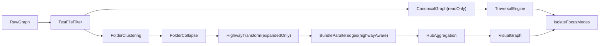

# Edge Routing and Folder Highway Plan (Revised Post-Review)

## Locked Decisions

- **Rollout:** one large PR with internal commit checkpoints.
- **Trunk granularity:** one bundled highway trunk per folder-pair (all relationship kinds aggregated), tooltip data attached.
- **Function imports:** function nodes stay module-embedded; import relationships stay module-attributed. Schema allows future first-class function support.
- **Validation mode:** metadata and warnings only (no hard rejection in edge creation).
- **Highway scope:** highways are produced by the transform only for **expanded** folders. Collapsed folders retain existing `collapseFolders` lift-and-dedup behavior unchanged. The "Locked Decision" from the prior plan claiming "both expanded and collapsed states" is corrected here.
- **Highway hub placement:** highway hubs are **top-level nodes** (no `parentNode`), matching the existing `hubAggregation.ts` pattern, so ELK layout does not treat them as folder children.
- **Tooltip UI:** trunk edge tooltip showing connection breakdown is **in scope** for this PR (data + basic tooltip rendering). Without it, weighted edges are opaque to users.
- **Focus mode dimming:** **out of scope** for this PR. `handleFocusNode` will use traversal for canonical neighbor identification but will not add dimming (that requires the same style-diffing machinery as selection highlighting, which is a separate concern).
- **Isolate folder expansion:** isolate mode will include containing folders as expanded containers in the isolated view (strip `data.isCollapsed` flag, include folder nodes). Module/symbol nodes keep their `parentNode` references so they render inside folders.

## Architecture (Canonical vs Visual)

- Keep a **canonical graph** (post-test-filtering, pre-folder transforms) for traversal semantics.
- Build a **visual graph** (folder clustering, collapse, highways, bundling) for rendering.
- Isolate/focus traverse canonical edges, then project selected results through visual highways.
- The canonical snapshot shares **structural references** with the source data (shallow copy, not deep clone) to mitigate memory cost. It must be treated as read-only.




## Reviewed Issues and Resolutions

### R1 - Handle field preservation through transforms (Critical #1)

**Problem:** Edge factories and transform spreads (`{ ...edge }`) could strip `sourceHandle`/`targetHandle` since they are top-level Vue Flow `Edge` properties, not in `data`.

**Resolution:**

- Add a `cloneEdge()` utility in `src/client/graph/edgeUtils.ts` that explicitly preserves `sourceHandle`, `targetHandle`, `hidden`, `style`, `data`, `markerEnd`, and all other relevant top-level fields.
- All transforms that create new edge objects (`collapseFolders`, `bundleParallelEdges`, `hubAggregation`, `folderHighways`) must use `cloneEdge()` instead of raw spreads.
- Add a unit test asserting `sourceHandle`/`targetHandle` survive through `bundleParallelEdges` and `collapseFolders`.

### R2 - `bundleParallelEdges` destroying highway segments (Critical #2)

**Problem:** Exit segments from multiple source nodes to the same highway hub share the same target. `bundleParallelEdges` groups by `source\0target` and keeps only the highest-priority representative, dropping the rest.

**Resolution:**

- Modify `bundleParallelEdges` in `[buildGraphView.ts](src/client/components/DependencyGraph/buildGraphView.ts)` to skip edges where `edge.data?.highwaySegment` is `'exit'` or `'entry'`. These edges are passed through unbundled.
- Trunk edges (`highwaySegment: 'highway'`) are already unique per folder-pair and do not need bundling.
- Add a unit test: create 3 exit segments to same hub, verify all 3 survive bundling.

### R3 - Canonical snapshot memory (Significant #3)

**Problem:** Three full copies of the graph in memory (nodes.value, overviewSnapshot, canonical).

**Resolution:**

- Canonical snapshot stores **the same array references** as the output of `filterGraphByTestVisibility`. Since folder clustering creates new node objects (with different `parentNode`, positions), the canonical arrays are the pre-clustering originals and share no mutable state with visual transforms.
- Document in code comment: "canonical arrays are read-only, do not mutate."
- Do NOT deep-clone canonical data. `Object.freeze()` in dev mode only (behind `import.meta.env.DEV` guard) for mutation detection.

### R4 - Highway hubs must not be folder children (Significant #4)

**Problem:** Claude's plan set `parentNode: folderId` on highway hubs. ELK layout would include these as children in the folder's internal layout, pushing real modules down.

**Resolution:**

- Highway boundary hubs are **top-level nodes** with `parentNode: undefined`. Match the existing `hubAggregation.ts` pattern (line 85-97, no `parentNode`).
- Position hubs relative to their associated folder during a post-layout step (or let ELK handle them as external nodes).

### R5 - `selectionAdjacencyByNodeId` broken for highway edges (Significant #5)

**Problem:** After the highway transform, `edges.value` contains exit/trunk/entry segments. Clicking a module that has cross-folder edges would highlight the highway hub, not the actual connected module on the other side.

**Resolution:**

- Extend the existing hub-resolution loop in `selectionAdjacencyByNodeId` (lines 494-512 of `[index.vue](src/client/components/DependencyGraph/index.vue)`). Highway hubs are `type: 'hub'`, so the existing `hubNodeIds` set already includes them. The current resolution code walks from each hub to its real neighbors. Since highway hubs connect exit segment sources to entry segment targets, the two-hop resolution (module -> hub -> trunk -> hub -> module) requires extending the resolution to traverse through **chains of hubs**, not just single hubs.
- Specifically: after the initial hub resolution pass, run a second pass that checks if any newly-added neighbor is itself a hub, and resolve through it. Cap at depth 3 to prevent infinite loops.
- Add a unit test for selection adjacency with a highway-segmented edge.

### R6 - Collapsed folder highway behavior clarification (Significant #6)

**Problem:** `collapseFolders` runs before the highway transform and removes child nodes. Highway transform receives a graph where collapsed folders have no children, so no highway segments would be created for them.

**Resolution:**

- This is actually correct behavior. Collapsed folders use existing `collapseFolders` lift-and-dedup. Highways only activate for expanded folders whose children are visible.
- Document this explicitly in `folderHighways.ts` header comment and in this plan (done above in "Locked Decisions").
- The edge from a collapsed folder to an expanded folder's highway hub is valid: the collapsed folder acts as a direct node endpoint, the expanded folder side gets highway segments.

### R7 - Handle ID naming convention (Minor #7)

**Resolution:** Use `folder-{side}-{role}` convention for folder handles. BaseNode handles remain unnamed (Vue Flow default) since they only have one source and one target. No prefix change needed. If BaseNode handles are named in the future, use `node-{role}` convention.

### R8 - Highway hub `type: 'hub'` (Minor #8)

**Resolution:** Confirmed. Highway boundary hubs use `type: 'hub'` so:

- `hubAggregation.ts` line 54 `skipTypes.has('hub')` excludes them from further fan-in aggregation.
- ELK layout worker applies 8x8 size hint.
- `selectionAdjacencyByNodeId` hub resolution includes them.

### R9 - E2E test fixture (Minor #9)

**Resolution:** E2E test for collapsed-folder isolate must explicitly set up a fixture with folder-mode enabled and at least one collapsed folder. Document the fixture dependency in the test file.

---

## Single-PR Workstreams

### 1) Edge utility + Semantic relationship registry

- Add `[src/client/graph/edgeUtils.ts](src/client/graph/edgeUtils.ts)`:
  - `cloneEdge(edge, overrides?)`: creates a new edge object preserving all top-level Vue Flow fields (`sourceHandle`, `targetHandle`, `style`, `hidden`, `markerEnd`, `data`, etc.) plus applying optional overrides.
  - Used by all transforms to replace raw `{ ...edge }` spreads.
- Add `[src/client/graph/relations/edgeTypeRegistry.ts](src/client/graph/relations/edgeTypeRegistry.ts)`:
  - `EdgeTypeDefinition` interface: `kind`, `label`, `validSources`, `validTargets`, `directed`, `handleCategory`.
  - Registry covering all 10 edge kinds: `import`, `extends`, `implements`, `inheritance`, `contains`, `dependency`, `devDependency`, `peerDependency`, `export`, `uses`.
  - Exports: `getEdgeTypeDefinition`, `getValidEdgeKindsForSource`, `isValidEdgeConnection`, `getHandleCategory`.
- Tests: `[src/client/graph/relations/__tests__/edgeTypeRegistry.test.ts](src/client/graph/relations/__tests__/edgeTypeRegistry.test.ts)`.

### 2) Edge typing and constructor wiring

- Update `[src/client/components/DependencyGraph/types.ts](src/client/components/DependencyGraph/types.ts)`:
  - Add highway metadata fields to `GraphEdge` data: `highwaySegment`, `highwayCount`, `highwayTypes`, `highwayGroupId`, `highwayTypeBreakdown`.
  - `sourceHandle`/`targetHandle` are already on the Vue Flow `Edge` base type (confirmed: `edge.d.ts` lines 71-73). No change needed for handle fields in the type alias.
- Update `[src/client/utils/createGraphEdges.ts](src/client/utils/createGraphEdges.ts)`:
  - Add `sourceHandle?` and `targetHandle?` optional params to `createEdge()`.
  - Wire `isValidEdgeConnection()` check with dev-mode `console.warn` when validation fails.
  - No dropped edges: warning only.

### 3) Directional folder handles

- Update `[src/client/components/DependencyGraph/nodes/GroupNode.vue](src/client/components/DependencyGraph/nodes/GroupNode.vue)`:
  - Replace current 4 unnamed handles (collapsed-only, lines 40-45) with 8 named handles.
  - Handles rendered in **both** expanded and collapsed states.
  - Handle IDs: `folder-top-in`, `folder-top-out`, `folder-right-in`, `folder-right-out`, `folder-bottom-in`, `folder-bottom-out`, `folder-left-in`, `folder-left-out`.
  - Incoming at 33% offset, outgoing at 66% offset on each side.
  - Styling: `width: 4px; height: 4px; opacity: 0.15; border: none;` with hover glow.
  - Accessibility: `tabindex="-1"` and `aria-hidden="true"`.
- Add `[src/client/graph/handleRouting.ts](src/client/graph/handleRouting.ts)`:
  - `FOLDER_HANDLE_IDS` constant object.
  - `selectFolderHandle(direction: 'LR'|'RL'|'TB'|'BT', role: 'incoming'|'outgoing'): string`.
  - Direction mapping:
    - LR: incoming -> `folder-left-in`, outgoing -> `folder-right-out`
    - RL: incoming -> `folder-right-in`, outgoing -> `folder-left-out`
    - TB: incoming -> `folder-top-in`, outgoing -> `folder-bottom-out`
    - BT: incoming -> `folder-bottom-in`, outgoing -> `folder-top-out`
- Tests: `[src/client/graph/__tests__/handleRouting.test.ts](src/client/graph/__tests__/handleRouting.test.ts)`.

### 4) Folder highway transform

- Add `[src/client/graph/transforms/folderHighways.ts](src/client/graph/transforms/folderHighways.ts)`:
  - **Input:** nodes and edges from `applyGraphTransforms()` (post-clustering/collapse).
  - **Step 1:** Build `nodeToFolder` map from `node.parentNode` (expanded folders only; collapsed folders have no children in the graph at this point).
  - **Step 2:** Classify edges: intra-folder (keep), cross-folder (replace), non-folder (keep).
  - **Step 3:** Create synthetic boundary hubs per folder: `highway-out:{folderId}`, `highway-in:{folderId}`. These are **top-level** nodes (`parentNode: undefined`, `type: 'hub'`).
  - **Step 4:** Replace cross-folder edges with 3 segments:
    - Exit: `sourceNode -> highway-out:folderA` (thin, colored by original type).
    - Trunk: `highway-out:folderA -> highway-in:folderB` (aggregated, weighted stroke: `Math.min(8, 1.5 + count * 0.4)`).
    - Entry: `highway-in:folderB -> targetNode` (thin, colored by original type).
  - **Step 5:** Set `sourceHandle`/`targetHandle` on exit, trunk, and entry edges using `selectFolderHandle()`.
  - **Step 6:** Trunk edges carry: `{ highwaySegment: 'highway', highwayCount, highwayTypes, highwayTypeBreakdown, highwayGroupId }`.
  - **Step 7:** Exit/entry edges carry: `{ highwaySegment: 'exit' | 'entry' }`.
  - **Nested folders:** When a node is inside folder B which is inside folder A, and the edge crosses folder A's boundary, create exit segments through each folder level. Trunk connects outermost folder boundaries. (Only relevant when both are expanded.)
- Refactor `[src/client/graph/cluster/collapseFolders.ts](src/client/graph/cluster/collapseFolders.ts)`:
  - Extract and export `buildParentMap(nodes): Map<string, string>`.
  - Extract and export `buildChildToFolderMap(nodes, collapsedFolderIds): Map<string, string>`.
  - Keep existing `collapseFolders` function as-is for backward compatibility.
- Integrate in `[src/client/components/DependencyGraph/buildGraphView.ts](src/client/components/DependencyGraph/buildGraphView.ts)`:
Pipeline order after changes:
  ```
  1. createGraphNodes + createGraphEdges
  2. filterEdgesByNodeSet
  3. filterGraphByTestVisibility
  4. >>> CAPTURE canonical snapshot here <<<
  5. applyGraphTransforms (folder clustering + optional collapse)
  6. >>> NEW: applyFolderHighways (if clusterByFolder) <<<
  7. applyEdgeVisibility
  8. hubAggregation (if enabled)
  9. bundleParallelEdges (UPDATED: skip highway exit/entry segments)
  10. buildDegreeMap + annotateOrphanDiagnostics
  ```
- Update `bundleParallelEdges` to skip edges with `data?.highwaySegment === 'exit' || data?.highwaySegment === 'entry'`. These pass through unbundled.
- Tests: `[src/client/graph/transforms/__tests__/folderHighways.test.ts](src/client/graph/transforms/__tests__/folderHighways.test.ts)`:
  - Cross-folder edge produces 3 segments.
  - Intra-folder edge kept as-is.
  - Multiple cross-folder edges between same folder-pair aggregate into single trunk.
  - Trunk `highwayCount` matches edge count.
  - Trunk `strokeWidth` scales correctly.
  - Highway exit/entry segments survive `bundleParallelEdges`.
  - Nested folders: proper segment chain through each level.
  - Handle IDs assigned correctly per graph direction.

### 5) Canonical graph snapshot for traversal

- Extend `GraphViewData` in `[buildGraphView.ts](src/client/components/DependencyGraph/buildGraphView.ts)`:
  ```typescript
  export interface GraphViewData {
    nodes: DependencyNode[];
    edges: GraphEdge[];
    canonicalNodes?: DependencyNode[];
    canonicalEdges?: GraphEdge[];
  }
  ```
  Set canonical data after test-file filtering, before `applyGraphTransforms`:
  ```typescript
  const filteredGraph = filterGraphByTestVisibility(unfilteredGraph, options.hideTestFiles);
  // Canonical = shallow reference, read-only, pre-folder transforms
  const canonicalNodes = filteredGraph.nodes;
  const canonicalEdges = filteredGraph.edges;
  ```
  Return them in the result object.
- Update `[src/client/stores/graphStore.ts](src/client/stores/graphStore.ts)`:
  - Add `canonicalSnapshot` ref alongside `overviewSnapshot`:
    ```typescript
    const canonicalSnapshot = ref<{ nodes: DependencyNode[]; edges: GraphEdge[] } | null>(null);
    ```
  - Add `setCanonicalSnapshot` action.
  - Expose as `canonicalSnapshot` (read) and `setCanonicalSnapshot` (write).
  - Do NOT persist canonical snapshot to localStorage (it is derived data).

### 6) Traversal rewrite for isolate/focus

- Add `[src/client/graph/traversal.ts](src/client/graph/traversal.ts)`:
  ```typescript
  export interface TraversalOptions {
    maxDepth: number;
    edgeFilter?: Set<DependencyEdgeKind>;
    canonicalEdges: GraphEdge[];
    canonicalNodes: DependencyNode[];
    parentMap: Map<string, string>;
  }

  export interface TraversalResult {
    nodeIds: Set<string>;
    edges: GraphEdge[];
    inbound: Set<string>;
    outbound: Set<string>;
    containingFolders: Set<string>;
    depthMap: Map<string, number>;
  }

  export function traverseGraph(
    startNodeId: string,
    options: TraversalOptions
  ): TraversalResult;
  ```
  Algorithm: BFS over canonical edges. For each discovered node, walk up `parentMap` to collect `containingFolders`. Classify into inbound/outbound relative to start node. Hub nodes in canonical edges: resolve through transparently.
- Rewrite `isolateNeighborhood()` in `[index.vue](src/client/components/DependencyGraph/index.vue)` (lines 1838-1990):
  - Use `traverseGraph()` with `maxDepth: 1` over `graphStore.canonicalSnapshot`.
  - Collect containing folders from traversal result. Include folder nodes with `isCollapsed: false` in isolated view.
  - Filter visual edges (from `graphStore.overviewSnapshot`) to only those connecting discovered canonical nodes or their containing folders.
  - Re-apply highway transform on the isolated subgraph for consistent routing.
  - Preserve existing layout logic (inbound/center/outbound sections, hub exclusion from layout groups).
  - Keep existing `isolateExpandAll`, measurement, and animation logic.
- Enhance `handleFocusNode()` in `[index.vue](src/client/components/DependencyGraph/index.vue)` (lines 1729-1745):
  - After camera zoom, run `traverseGraph({ maxDepth: 1 })` to identify connected nodes.
  - **No dimming** in this PR (out of scope). Instead, store the connected node IDs so `selectionAdjacencyByNodeId` can use them for highlight resolution.
- Update `selectionAdjacencyByNodeId` (lines 463-549):
  - After the existing hub resolution pass (lines 494-512), add a second pass that resolves through **chains of hubs** (highway hub -> trunk edge -> highway hub). Cap resolution depth at 3.
  - This ensures clicking a module with cross-folder edges highlights the actual connected module, not just the highway hub.
- Tests: `[src/client/graph/__tests__/traversal.test.ts](src/client/graph/__tests__/traversal.test.ts)`:
  - 1-hop finds direct neighbors.
  - Multi-hop (depth 2+) finds transitive neighbors.
  - Traversal resolves through canonical graph (not visual/collapsed).
  - `containingFolders` includes all ancestor folders.
  - Edge filter restricts traversal to specified types.
  - Hub node transparency.

### 7) Canvas and virtualization compatibility

- Update `[CanvasEdgeLayer.vue](src/client/components/DependencyGraph/components/CanvasEdgeLayer.vue)` (lines 195-200):
  - When an edge has `sourceHandle` or `targetHandle` set, derive anchor point from node bounds + handle offset convention rather than using `sourceAnchor`/`targetAnchor` from `edge.data`.
  - Add a `resolveHandlePosition(nodeId, handleId, nodeCenters, nodeList)` helper that computes the pixel position from the handle ID naming convention (`folder-{side}-{in|out}`, 33% or 66% offset).
  - Fallback chain: `handlePosition -> data.sourceAnchor -> nodeCenter`.
- Update `[edgeVirtualizationCore.ts](src/client/components/DependencyGraph/edgeVirtualizationCore.ts)`:
  - Extend `EdgeVirtualizationEdge` interface with optional `sourceHandle?: string` and `targetHandle?: string`.
  - When computing edge segment bounds for viewport intersection, use handle-aware positions if available.
- Update `[useEdgeVirtualizationWorker.ts](src/client/components/DependencyGraph/useEdgeVirtualizationWorker.ts)`:
  - Include `sourceHandle`/`targetHandle` in serialized edge data sent to the worker.

### 8) Tests and validation

- New test files:
  - `[src/client/graph/relations/__tests__/edgeTypeRegistry.test.ts](src/client/graph/relations/__tests__/edgeTypeRegistry.test.ts)`
  - `[src/client/graph/__tests__/handleRouting.test.ts](src/client/graph/__tests__/handleRouting.test.ts)`
  - `[src/client/graph/transforms/__tests__/folderHighways.test.ts](src/client/graph/transforms/__tests__/folderHighways.test.ts)`
  - `[src/client/graph/__tests__/traversal.test.ts](src/client/graph/__tests__/traversal.test.ts)`
- Extend existing:
  - `[src/client/components/DependencyGraph/__tests__/buildGraphView.test.ts](src/client/components/DependencyGraph/__tests__/buildGraphView.test.ts)`: verify canonical snapshot populated, highway transform inserted, `bundleParallelEdges` preserves highway segments.
  - `[src/client/utils/__tests__/createGraphEdges.test.ts](src/client/utils/__tests__/createGraphEdges.test.ts)`: verify dev warning on invalid edge type pairs.
  - `[tests/e2e/graph-interaction.spec.ts](tests/e2e/graph-interaction.spec.ts)`: collapsed-folder isolate/focus traversal (explicit fixture setup).
- Final gate: `pnpm test`, `pnpm lint`, `pnpm typecheck`.

## Commit Checkpoints

1. `checkpoint-1`: `cloneEdge` utility + registry + type updates + `createEdge` wiring.
2. `checkpoint-2`: folder handles + handle routing helper.
3. `checkpoint-3`: `folderHighways` transform + `collapseFolders` exports + `buildGraphView` integration + `bundleParallelEdges` highway awareness.
4. `checkpoint-4`: canonical snapshot + traversal module + isolate/focus rewrite + `selectionAdjacencyByNodeId` hub chain resolution.
5. `checkpoint-5`: canvas/virtualization handle-aware anchor resolution.
6. `checkpoint-6`: all tests + validation fixes.

## Key Risks and Mitigations

- **Risk:** Canonical and visual graphs drift.
  - Mitigation: canonical is a shallow reference from the same pipeline. Unit tests assert canonical is pre-transform.
- **Risk:** Handle-based anchors misalign in canvas mode.
  - Mitigation: deterministic offset computation from handle naming convention. Center fallback always available.
- **Risk:** Hub aggregation further aggregates highway trunks.
  - Mitigation: `hubAggregation.ts` already skips `type: 'hub'` targets (line 54). Highway hubs are `type: 'hub'`, so they won't be selected as fan-in aggregation targets.
- **Risk:** `selectionAdjacencyByNodeId` hub chain resolution is O(hubs * neighbors).
  - Mitigation: cap at depth 3. Highway hubs are few (2 per folder with cross-folder edges). Linear in practice.
- **Risk:** `bundleParallelEdges` exit/entry bypass inflates edge count.
  - Mitigation: exit/entry edges are thin individual lines. Their count equals the original cross-folder edge count, which was already present pre-highway. No net inflation.

## All Files Summary

**New files (9):**


| File                                                            | Purpose                                         |
| --------------------------------------------------------------- | ----------------------------------------------- |
| `src/client/graph/edgeUtils.ts`                                 | `cloneEdge` utility for safe edge spreading     |
| `src/client/graph/relations/edgeTypeRegistry.ts`                | Semantic relationship schema + lookups          |
| `src/client/graph/relations/__tests__/edgeTypeRegistry.test.ts` | Registry tests                                  |
| `src/client/graph/handleRouting.ts`                             | Handle ID constants + direction-based selection |
| `src/client/graph/__tests__/handleRouting.test.ts`              | Handle routing tests                            |
| `src/client/graph/transforms/folderHighways.ts`                 | Highway transform core                          |
| `src/client/graph/transforms/__tests__/folderHighways.test.ts`  | Highway transform tests                         |
| `src/client/graph/traversal.ts`                                 | Deep BFS traversal with folder resolution       |
| `src/client/graph/__tests__/traversal.test.ts`                  | Traversal tests                                 |


**Modified files (10):**


| File                                                                   | Changes                                             |
| ---------------------------------------------------------------------- | --------------------------------------------------- |
| `src/client/components/DependencyGraph/types.ts`                       | Add highway metadata fields to GraphEdge data       |
| `src/client/utils/createGraphEdges.ts`                                 | Optional handle params, dev-mode validation warning |
| `src/client/components/DependencyGraph/nodes/GroupNode.vue`            | 8 named handles, both states                        |
| `src/client/components/DependencyGraph/buildGraphView.ts`              | Highway step + canonical output + bundle awareness  |
| `src/client/graph/cluster/collapseFolders.ts`                          | Export `buildParentMap` + `buildChildToFolderMap`   |
| `src/client/stores/graphStore.ts`                                      | Add `canonicalSnapshot`                             |
| `src/client/components/DependencyGraph/index.vue`                      | Rewrite isolate, enhance focus, fix adjacency       |
| `src/client/components/DependencyGraph/components/CanvasEdgeLayer.vue` | Handle-based anchor lookup                          |
| `src/client/components/DependencyGraph/useEdgeVirtualizationWorker.ts` | Serialize handle fields                             |
| `src/client/components/DependencyGraph/edgeVirtualizationCore.ts`      | Handle-aware segment bounds                         |


