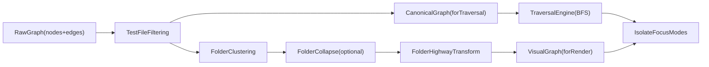

# Edge Routing and Folder Highway Plan (Merged, Single PR)

## Locked Decisions

- **Rollout:** one large PR with internal checkpoints only.
- **Trunk granularity:** one bundled highway trunk per folder-pair (all relationship kinds aggregated).
- **Function imports:** function nodes stay module-embedded for now; import relationships stay module-attributed.
- **Validation mode:** metadata and warnings only (no hard rejection in edge creation).
- **Highway scope:** active in both expanded and collapsed folder states.

## Architecture (Canonical vs Visual)

- Keep a **canonical graph** (pre-folder transforms) for traversal semantics.
- Build a **visual graph** (folder clustering, collapse, highways) for rendering.
- Isolate/focus traverse canonical edges, then project selected results through visual highways.

## Single-PR Workstreams

### 1) Semantic relationship registry

- Add `[src/client/graph/relations/edgeTypeRegistry.ts](src/client/graph/relations/edgeTypeRegistry.ts)`:
  - `EdgeTypeDefinition` (`kind`, `label`, `validSources`, `validTargets`, `directed`, `handleCategory`).
  - `getEdgeTypeDefinition`, `getValidEdgeKindsForSource`, `isValidEdgeConnection`, `getHandleCategory`.
- Cover documented edge kinds and endpoint pairs (`import`, `inherits/extends`, `implements`, `contains`, `uses`, package dependency kinds, `export`).
- Add tests: `[src/client/graph/relations/__tests__/edgeTypeRegistry.test.ts](src/client/graph/relations/__tests__/edgeTypeRegistry.test.ts)`.

### 2) Edge typing and constructor wiring

- Update `[src/client/components/DependencyGraph/types.ts](src/client/components/DependencyGraph/types.ts)`:
  - keep highway metadata in `GraphEdge.data` (`highwaySegment`, `highwayCount`, `highwayTypes`, `highwayGroupId`, optional per-type breakdown).
  - **Do not duplicate handle IDs in `data**`; use top-level Vue Flow edge fields `sourceHandle` and `targetHandle`.
- Update `[src/client/utils/createGraphEdges.ts](src/client/utils/createGraphEdges.ts)`:
  - route all edge creation through one helper.
  - if registry says source/target pair is invalid, emit dev warning only.
  - keep behavior backward compatible (no dropped edges).

### 3) Directional folder handles

- Update `[src/client/components/DependencyGraph/nodes/GroupNode.vue](src/client/components/DependencyGraph/nodes/GroupNode.vue)`:
  - add 8 named handles (`folder-top-in/out`, `folder-right-in/out`, `folder-bottom-in/out`, `folder-left-in/out`).
  - incoming at 33%, outgoing at 66% on each side.
  - render in expanded and collapsed states.
  - subtle visibility and keyboard-safe behavior.
- Add routing helper `[src/client/graph/handleRouting.ts](src/client/graph/handleRouting.ts)`:
  - handle constants.
  - `selectFolderHandle(direction, role)` mapping for LR/RL/TB/BT.

### 4) Folder highway transform

- Add `[src/client/graph/transforms/folderHighways.ts](src/client/graph/transforms/folderHighways.ts)`:
  - classify edges into intra-folder, cross-folder, and non-folder edges.
  - replace cross-folder edges with `exit -> trunk -> entry` segments.
  - aggregate trunks by folder-pair with weighted stroke and relationship breakdown metadata.
  - use synthetic boundary hubs consistent with existing `hub` node pattern.
- Refactor and reuse folder ancestry helpers in `[src/client/graph/cluster/collapseFolders.ts](src/client/graph/cluster/collapseFolders.ts)`:
  - export stable parent/folder membership map builders for highways and traversal.
- Integrate in `[src/client/components/DependencyGraph/buildGraphView.ts](src/client/components/DependencyGraph/buildGraphView.ts)`:
  - run after folder clustering/collapse, before edge visibility and downstream aggregation.

### 5) Canonical graph snapshot for traversal

- Extend `GraphViewData` in `[src/client/components/DependencyGraph/buildGraphView.ts](src/client/components/DependencyGraph/buildGraphView.ts)`:
  - include `canonicalNodes`/`canonicalEdges` captured after test-file filtering and before folder/highway transforms.
- Update `[src/client/stores/graphStore.ts](src/client/stores/graphStore.ts)`:
  - persist canonical graph snapshot alongside existing overview visual snapshot.

### 6) Traversal rewrite for isolate/focus

- Add `[src/client/graph/traversal.ts](src/client/graph/traversal.ts)`:
  - BFS with depth limit and optional edge-type filters over canonical graph.
  - parent-folder resolution to identify containing folders for display.
- Rewrite isolate/focus logic in `[src/client/components/DependencyGraph/index.vue](src/client/components/DependencyGraph/index.vue)`:
  - isolate uses traversal output from canonical graph.
  - visual selection rendered through highway-aware graph, without stopping at folder boundaries.
  - maintain existing hub transparency behavior.

### 7) Canvas and virtualization compatibility

- Update `[src/client/components/DependencyGraph/components/CanvasEdgeLayer.vue](src/client/components/DependencyGraph/components/CanvasEdgeLayer.vue)`:
  - if edge has `sourceHandle`/`targetHandle`, derive endpoints from node bounds + handle ID conventions.
  - fallback to anchor fields and then center-based routing.
- Update serialization/core where required:
  - `[src/client/components/DependencyGraph/useEdgeVirtualizationWorker.ts](src/client/components/DependencyGraph/useEdgeVirtualizationWorker.ts)`
  - `[src/client/components/DependencyGraph/edgeVirtualizationCore.ts](src/client/components/DependencyGraph/edgeVirtualizationCore.ts)`

### 8) Tests and validation

- Add tests:
  - `[src/client/graph/__tests__/handleRouting.test.ts](src/client/graph/__tests__/handleRouting.test.ts)`
  - `[src/client/graph/transforms/__tests__/folderHighways.test.ts](src/client/graph/transforms/__tests__/folderHighways.test.ts)`
  - `[src/client/graph/__tests__/traversal.test.ts](src/client/graph/__tests__/traversal.test.ts)`
- Extend existing:
  - `[src/client/components/DependencyGraph/__tests__/buildGraphView.test.ts](src/client/components/DependencyGraph/__tests__/buildGraphView.test.ts)`
  - `[src/client/utils/__tests__/createGraphEdges.test.ts](src/client/utils/__tests__/createGraphEdges.test.ts)`
  - `[tests/e2e/graph-interaction.spec.ts](tests/e2e/graph-interaction.spec.ts)` for collapsed-folder isolate/focus traversal.
- Final gate (single PR): `pnpm test`, `pnpm lint`, `pnpm typecheck`, targeted E2E highway/isolate checks.

## Commit Checkpoints Inside the Single PR

- `checkpoint-1`: registry + type updates + createEdge wiring.
- `checkpoint-2`: folder handles + handle routing helper.
- `checkpoint-3`: folderHighways transform + buildGraphView integration.
- `checkpoint-4`: canonical snapshot + traversal module + isolate/focus rewrite.
- `checkpoint-5`: canvas/virtualization compatibility.
- `checkpoint-6`: tests + validation fixes.

## Key Risks and Mitigations

- Risk: canonical and visual graphs drift.
  - Mitigation: explicit canonical snapshot contract and unit tests asserting pre/post transform invariants.
- Risk: handle-based anchors misalign in hybrid canvas mode.
  - Mitigation: deterministic handle geometry mapping and center fallback.
- Risk: interaction conflicts with existing hub aggregation.
  - Mitigation: apply highways before optional hub aggregation and exclude already-aggregated trunk classes where necessary.

