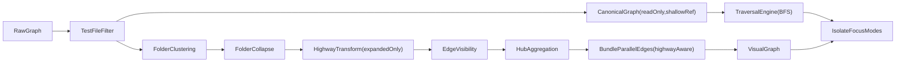

# Edge Routing and Folder Highway System -- Definitive Tech Design

## Context

The current edge rendering is flat: edges connect nodes via unnamed handles, folder collapse lifts edges to boundaries via simple deduplication, and isolate/focus traversals stop at folder boundaries. There is no concept of edge endpoint constraints, no structured routing through folder boundaries, and no visual distinction between edge "highways" and individual connections.

This design introduces three interconnected improvements:

- **Semantic Relationship Schema** -- a language-aware registry declaring valid source/target node types per edge kind (metadata, not strict validation).
- **Folder Boundary Handles and Edge Highways** -- directional named handles on folder nodes with synthetic hub nodes and weighted trunk edges for cross-folder connections.
- **Deep Graph Traversal** -- isolate/focus modes that operate on a canonical entity-edge graph and resolve through folder boundaries to reach actual modules/symbols.

---

## Locked Decisions

- **Rollout:** one large PR with internal commit checkpoints.
- **Trunk granularity:** one bundled highway trunk per folder-pair (all relationship kinds aggregated), with tooltip data showing per-type breakdown.
- **Function imports:** function nodes stay module-embedded; import relationships stay module-attributed. Schema allows future first-class function support without breaking changes.
- **Validation mode:** metadata and dev warnings only. No hard rejection in edge creation. Invalid edges are allowed but flagged.
- **Highway scope:** highways are produced by the transform only for **expanded** folders. Collapsed folders retain existing `collapseFolders` lift-and-dedup behavior unchanged. The edge from a collapsed folder to an expanded folder's highway hub is valid: the collapsed folder acts as a direct node endpoint, the expanded folder side gets highway segments.
- **Highway hub placement:** highway hubs are **top-level nodes** (no `parentNode`), matching the existing `[hubAggregation.ts](src/client/graph/transforms/hubAggregation.ts)` pattern (line 85-97), so ELK layout does not treat them as folder children.
- **Tooltip UI:** trunk edge tooltip showing connection breakdown is **in scope** (data + basic tooltip rendering). Without it, weighted edges are opaque to users.
- **Focus mode dimming:** **out of scope**. `handleFocusNode` will use traversal for canonical neighbor identification but will not add dimming. That requires the same style-diffing machinery as selection highlighting and is a separate concern.
- **Isolate folder expansion:** isolate mode will include containing folders as expanded containers in the isolated view (strip `data.isCollapsed` flag, include folder nodes). Module/symbol nodes keep their `parentNode` references so they render inside folders.
- **Handle naming:** `folder-{side}-{role}` for folder handles. BaseNode handles remain unnamed (Vue Flow default). Future BaseNode naming would use `node-{role}`.

---

## Architecture

### Canonical vs Visual Graph

- **Canonical graph:** captured post-test-filtering, pre-folder transforms. Used by the traversal engine for isolate/focus. Shares structural array references with the source data (shallow copy, not deep clone). Treated as read-only. `Object.freeze()` applied in dev mode for mutation detection.
- **Visual graph:** folder clustering, collapse, highways, bundling, hub aggregation. Used for rendering.
- Isolate/focus traverse canonical edges, then project selected results through visual highways.




### Build Pipeline (exact order)

```
 1. createGraphNodes + createGraphEdges
 2. filterEdgesByNodeSet
 3. filterGraphByTestVisibility
 4. >>> CAPTURE canonical snapshot (shallow reference) <<<
 5. applyGraphTransforms (folder clustering + optional collapse)
 6. >>> applyFolderHighways (if clusterByFolder) <<<
 7. applyEdgeVisibility
 8. hubAggregation (if enabled)
 9. bundleParallelEdges (skip highway exit/entry segments)
10. buildDegreeMap + annotateOrphanDiagnostics
```

---

## Staff Tech Review Resolutions

Nine issues were identified during staff-level tech review. All are addressed in this design.

### R1 - Handle field preservation through transforms [Critical]

**Problem:** Edge factories and transform spreads (`{ ...edge }`) could strip `sourceHandle`/`targetHandle` since they are top-level Vue Flow `Edge` properties, not in `data`.

**Resolution:** Add a `cloneEdge()` utility in `[src/client/graph/edgeUtils.ts](src/client/graph/edgeUtils.ts)` that explicitly preserves all top-level Vue Flow fields. All transforms (`collapseFolders`, `bundleParallelEdges`, `hubAggregation`, `folderHighways`) must use `cloneEdge()` instead of raw spreads. Unit test asserts `sourceHandle`/`targetHandle` survive through `bundleParallelEdges` and `collapseFolders`.

### R2 - `bundleParallelEdges` destroying highway segments [Critical]

**Problem:** Exit segments from multiple source nodes to the same highway hub share the same target. `bundleParallelEdges` groups by `source\0target` and keeps only the highest-priority representative, destroying the others.

**Resolution:** Modify `bundleParallelEdges` to skip edges where `edge.data?.highwaySegment` is `'exit'` or `'entry'`. These pass through unbundled. Trunk edges are already unique per folder-pair. Unit test: 3 exit segments to same hub all survive bundling.

### R3 - Canonical snapshot memory cost [Significant]

**Problem:** Three full graph copies in memory (nodes.value, overviewSnapshot, canonical).

**Resolution:** Canonical stores the **same array references** from `filterGraphByTestVisibility`. Since folder clustering creates new objects, canonical arrays share no mutable state with visual transforms. No deep clone. `Object.freeze()` in dev mode only. Do NOT persist canonical to localStorage.

### R4 - Highway hubs must not be folder children [Significant]

**Problem:** Setting `parentNode: folderId` on highway hubs would make ELK layout treat them as folder children, disrupting internal layout.

**Resolution:** Highway boundary hubs are **top-level nodes** (`parentNode: undefined`), `type: 'hub'`. Matches `hubAggregation.ts` pattern exactly. ELK positions them as external nodes.

### R5 - `selectionAdjacencyByNodeId` broken for highway edges [Significant]

**Problem:** After the highway transform, clicking a module with cross-folder edges would highlight the highway hub, not the actual connected module.

**Resolution:** Extend the hub-resolution loop in `selectionAdjacencyByNodeId` (lines 494-512 of `[index.vue](src/client/components/DependencyGraph/index.vue)`) to resolve through **chains of hubs** (highway hub -> trunk -> highway hub -> real node). After the initial pass, run a second pass checking if newly-added neighbors are hubs. Cap at depth 3.

### R6 - Collapsed folder highway behavior [Significant]

**Problem:** `collapseFolders` runs before highway transform and removes child nodes. No highway segments created for collapsed folders.

**Resolution:** This is correct behavior. Collapsed folders use existing lift-and-dedup. Highways only activate for expanded folders. Document explicitly in `folderHighways.ts` header.

### R7 - Handle ID naming convention [Minor]

**Resolution:** `folder-{side}-{role}` for folders. BaseNode unnamed. Future: `node-{role}`.

### R8 - Highway hub `type: 'hub'` [Minor]

**Resolution:** Confirmed `type: 'hub'`. This means: `hubAggregation.ts` skips them (line 54), ELK applies 8x8 size hint, `selectionAdjacencyByNodeId` includes them in resolution.

### R9 - E2E test fixture [Minor]

**Resolution:** E2E test for collapsed-folder isolate must explicitly set up fixture with folder-mode enabled and at least one collapsed folder. Documented in test.

---

## Workstream 1: Edge Utility and Semantic Relationship Registry

### 1a. `cloneEdge` utility

**New file:** `[src/client/graph/edgeUtils.ts](src/client/graph/edgeUtils.ts)`

```typescript
export function cloneEdge(edge: GraphEdge, overrides?: Partial<GraphEdge>): GraphEdge {
  return {
    ...edge,
    // Explicitly preserve top-level Vue Flow fields that raw spreads could miss
    sourceHandle: edge.sourceHandle,
    targetHandle: edge.targetHandle,
    // Apply overrides last
    ...overrides,
    // Deep-merge data if overrides contain data
    data: overrides?.data
      ? { ...edge.data, ...overrides.data }
      : edge.data,
  } as GraphEdge;
}
```

Used by all transforms. Replaces raw `{ ...edge }` spreads.

### 1b. Relationship Registry

**New file:** `[src/client/graph/relations/edgeTypeRegistry.ts](src/client/graph/relations/edgeTypeRegistry.ts)`

```typescript
export interface EdgeTypeDefinition {
  kind: DependencyEdgeKind;
  label: string;
  validSources: readonly DependencyKind[];
  validTargets: readonly DependencyKind[];
  directed: boolean;
  handleCategory: 'structural' | 'relational';
}
```

**Full registry table:**

- `import`: sources `[module, function]`, targets `[module]`, relational
- `extends`: sources `[class, interface]`, targets `[class, interface]`, relational
- `implements`: sources `[class]`, targets `[interface]`, relational
- `inheritance`: sources `[class, interface]`, targets `[class, interface]`, relational
- `contains`: sources `[module, class, interface]`, targets `[class, interface, function, property, method, enum, type]`, structural
- `dependency`: sources `[package]`, targets `[package]`, relational
- `devDependency`: sources `[package]`, targets `[package]`, relational
- `peerDependency`: sources `[package]`, targets `[package]`, relational
- `export`: sources `[module]`, targets `[module]`, relational
- `uses`: sources `[class, interface, function, method]`, targets `[property, method]`, relational

**Exported functions:**

- `getEdgeTypeDefinition(kind)`: returns definition or undefined.
- `getValidEdgeKindsForSource(nodeType)`: returns edge kinds where nodeType is a valid source.
- `isValidEdgeConnection(kind, sourceType, targetType)`: returns boolean.
- `getHandleCategory(kind)`: returns `'structural'` or `'relational'`.

### 1c. Tests

**New file:** `[src/client/graph/relations/__tests__/edgeTypeRegistry.test.ts](src/client/graph/relations/__tests__/edgeTypeRegistry.test.ts)`

- All 10 edge kinds return valid definitions.
- `isValidEdgeConnection` returns true for documented pairs, false for invalid pairs.
- `getHandleCategory` returns correct category for structural vs relational.
- Future-proofing: function as import source validates correctly.

---

## Workstream 2: Edge Typing and Constructor Wiring

### 2a. Type extensions

**File:** `[src/client/components/DependencyGraph/types.ts](src/client/components/DependencyGraph/types.ts)`

Add highway metadata fields to `GraphEdge` data (the `Edge<{ ... }>` generic parameter):

```typescript
export type GraphEdge = Edge<{
  type?: DependencyEdgeKind;
  importName?: string | undefined;
  usageKind?: 'method' | 'property' | undefined;
  bundledCount?: number;
  bundledTypes?: DependencyEdgeKind[];
  sourceAnchor?: { x: number; y: number };
  targetAnchor?: { x: number; y: number };
  hubAggregated?: boolean;
  aggregatedCount?: number;
  // Highway metadata
  highwaySegment?: 'exit' | 'highway' | 'entry';
  highwayCount?: number;
  highwayTypes?: DependencyEdgeKind[];
  highwayGroupId?: string;
  highwayTypeBreakdown?: Record<string, number>;
}>;
```

`sourceHandle`/`targetHandle` are already on the Vue Flow `Edge` base type (`edge.d.ts` lines 71-73). No change needed for handle fields in the type alias.

### 2b. Constructor wiring

**File:** `[src/client/utils/createGraphEdges.ts](src/client/utils/createGraphEdges.ts)`

Update `createEdge` (line 334) to accept optional `sourceHandle?` and `targetHandle?` parameters:

```typescript
function createEdge(
  source: string,
  target: string,
  type: DependencyEdgeKind,
  importName?: string,
  sourceHandle?: string,
  targetHandle?: string,
): GraphEdge {
  if (import.meta.env.DEV) {
    // Dev-mode validation warning (registry lookup)
  }
  return {
    id: `${source}-${target}-${type}`,
    source,
    target,
    sourceHandle: sourceHandle ?? undefined,
    targetHandle: targetHandle ?? undefined,
    hidden: false,
    data: { type, ...(importName ? { importName } : {}) },
    style: getEdgeStyle(type),
    markerEnd: createArrowMarker(),
  } as GraphEdge;
}
```

No dropped edges. Warning only on invalid pairs. Backward compatible.

---

## Workstream 3: Directional Folder Handles

### 3a. GroupNode handles

**File:** `[src/client/components/DependencyGraph/nodes/GroupNode.vue](src/client/components/DependencyGraph/nodes/GroupNode.vue)`

Replace current 4 unnamed handles (lines 40-45, collapsed-only) with 8 named handles rendered in **both** expanded and collapsed states:

- `folder-top-in` (target, Top, left: 33%) -- incoming
- `folder-top-out` (source, Top, left: 66%) -- outgoing
- `folder-right-in` (target, Right, top: 33%) -- incoming
- `folder-right-out` (source, Right, top: 66%) -- outgoing
- `folder-bottom-in` (target, Bottom, left: 33%) -- incoming
- `folder-bottom-out` (source, Bottom, left: 66%) -- outgoing
- `folder-left-in` (target, Left, top: 33%) -- incoming
- `folder-left-out` (source, Left, top: 66%) -- outgoing

**Styling:** `width: 4px; height: 4px; opacity: 0.15; border: none;` -- near-invisible by default. Subtle glow on hover or when connected.

**Accessibility:** `tabindex="-1"` and `aria-hidden="true"` to preserve keyboard flow (WCAG).

### 3b. Handle routing utility

**New file:** `[src/client/graph/handleRouting.ts](src/client/graph/handleRouting.ts)`

```typescript
export const FOLDER_HANDLE_IDS = {
  topIn: 'folder-top-in',
  topOut: 'folder-top-out',
  rightIn: 'folder-right-in',
  rightOut: 'folder-right-out',
  bottomIn: 'folder-bottom-in',
  bottomOut: 'folder-bottom-out',
  leftIn: 'folder-left-in',
  leftOut: 'folder-left-out',
} as const;

export function selectFolderHandle(
  direction: 'LR' | 'RL' | 'TB' | 'BT',
  role: 'incoming' | 'outgoing'
): string;
```

**Direction mapping:**

- LR: incoming -> `folder-left-in`, outgoing -> `folder-right-out`
- RL: incoming -> `folder-right-in`, outgoing -> `folder-left-out`
- TB: incoming -> `folder-top-in`, outgoing -> `folder-bottom-out`
- BT: incoming -> `folder-bottom-in`, outgoing -> `folder-top-out`

### 3c. Tests

**New file:** `[src/client/graph/__tests__/handleRouting.test.ts](src/client/graph/__tests__/handleRouting.test.ts)`

- `selectFolderHandle` returns correct IDs for all 4 directions x 2 roles.

---

## Workstream 4: Folder Highway Transform

### 4a. Core transform

**New file:** `[src/client/graph/transforms/folderHighways.ts](src/client/graph/transforms/folderHighways.ts)`

**Input:** nodes and edges from `applyGraphTransforms()` (post-clustering/collapse), plus graph direction.

**Algorithm:**

**Step 1 -- Build folder membership map:**

```typescript
// nodeId -> immediate parent folder ID (from node.parentNode)
// Only expanded folders have children in the node list at this point.
const nodeToFolder = new Map<string, string>();
for (const node of nodes) {
  if (node.parentNode) {
    nodeToFolder.set(node.id, node.parentNode);
  }
}
```

**Step 2 -- Classify edges:**

For each edge, check source/target folder membership:

- **Intra-folder:** both in same folder -> keep as-is.
- **Cross-folder:** different folders (or one outside any folder) -> replace with highway segments.
- **Non-folder:** neither endpoint in a folder -> keep as-is.

**Step 3 -- Create synthetic boundary hubs per folder:**

For each folder with cross-folder edges, create two invisible hub nodes:

- `highway-out:{folderId}` -- outgoing aggregation point.
- `highway-in:{folderId}` -- incoming aggregation point.

Hub nodes are **top-level** (no `parentNode`), `type: 'hub'`, `selectable: false`, `focusable: false`, 8x8 sizing.

**Step 4 -- Replace cross-folder edges with 3 segments:**

For edge `sourceNode` (in folderA) -> `targetNode` (in folderB):

- **Exit segment:** `sourceNode -> highway-out:folderA`
  - `sourceHandle`: undefined (node default)
  - `targetHandle`: `selectFolderHandle(direction, 'outgoing')` on folderA
  - Thin line, colored by original edge type
  - `data.highwaySegment = 'exit'`
- **Trunk segment:** `highway-out:folderA -> highway-in:folderB`
  - `sourceHandle`: `selectFolderHandle(direction, 'outgoing')` on folderA
  - `targetHandle`: `selectFolderHandle(direction, 'incoming')` on folderB
  - All edges between same folder pair merge into one trunk
  - `strokeWidth = Math.min(8, 1.5 + count * 0.4)`
  - `data = { highwaySegment: 'highway', highwayCount, highwayTypes, highwayTypeBreakdown, highwayGroupId }`
- **Entry segment:** `highway-in:folderB -> targetNode`
  - `sourceHandle`: `selectFolderHandle(direction, 'incoming')` on folderB
  - `targetHandle`: undefined (node default)
  - Thin line, colored by original edge type
  - `data.highwaySegment = 'entry'`

**Step 5 -- Nested folders:**

When a node is inside folder B which is inside folder A, and the edge crosses folder A's boundary:

- Create exit segments through each folder level.
- Trunk connects outermost folder boundaries.
- Only relevant when both folders are expanded.

**Step 6 -- Trunk tooltip data:**

Each trunk edge carries metadata for tooltip display:

```typescript
{
  highwayCount: 12,
  highwayTypes: ['import', 'inheritance', 'implements'],
  highwayTypeBreakdown: { import: 8, inheritance: 3, implements: 1 }
}
```

### 4b. Refactor `collapseFolders`

**File:** `[src/client/graph/cluster/collapseFolders.ts](src/client/graph/cluster/collapseFolders.ts)`

Extract and export reusable helpers:

```typescript
export function buildParentMap(nodes: DependencyNode[]): Map<string, string>;
export function buildChildToFolderMap(
  nodes: DependencyNode[],
  collapsedFolderIds: Set<string>
): Map<string, string>;
```

Existing `collapseFolders` stays as-is for backward compat. Highway transform calls `buildParentMap` independently.

### 4c. `buildGraphView` integration

**File:** `[src/client/components/DependencyGraph/buildGraphView.ts](src/client/components/DependencyGraph/buildGraphView.ts)`

Insert `applyFolderHighways` after `applyGraphTransforms`, before `applyEdgeVisibility`:

```typescript
const transformedGraph = applyGraphTransforms(filteredGraph, { ... });

let highwayGraph = transformedGraph;
if (options.clusterByFolder) {
  highwayGraph = applyFolderHighways(
    transformedGraph.nodes,
    transformedGraph.edges,
    { direction: options.direction }
  );
}

const visibleEdges = applyEdgeVisibility(highwayGraph.edges, ...);
```

### 4d. `bundleParallelEdges` highway awareness

**File:** `[src/client/components/DependencyGraph/buildGraphView.ts](src/client/components/DependencyGraph/buildGraphView.ts)`

Update `bundleParallelEdges` (line 99) to skip highway exit/entry segments:

```typescript
function bundleParallelEdges(edges: GraphEdge[]): GraphEdge[] {
  if (edges.length < 50) return edges;

  // Highway exit/entry segments pass through unbundled
  const highwayPassthrough: GraphEdge[] = [];
  const bundleable: GraphEdge[] = [];
  for (const edge of edges) {
    const seg = edge.data?.highwaySegment;
    if (seg === 'exit' || seg === 'entry') {
      highwayPassthrough.push(edge);
    } else {
      bundleable.push(edge);
    }
  }

  // ... existing bundling logic on bundleable ...
  return [...result, ...highwayPassthrough];
}
```

### 4e. Tests

**New file:** `[src/client/graph/transforms/__tests__/folderHighways.test.ts](src/client/graph/transforms/__tests__/folderHighways.test.ts)`

- Cross-folder edge produces 3 segments (exit + trunk + entry).
- Intra-folder edge kept as-is.
- Multiple cross-folder edges between same folder-pair aggregate into single trunk.
- Trunk `highwayCount` matches edge count.
- Trunk `strokeWidth` scales correctly.
- Highway exit/entry segments survive `bundleParallelEdges`.
- Nested folders: proper segment chain through each level.
- Handle IDs assigned correctly per graph direction (all 4 directions).
- `cloneEdge` preserves `sourceHandle`/`targetHandle` through the transform.

---

## Workstream 5: Canonical Graph Snapshot

### 5a. `GraphViewData` extension

**File:** `[src/client/components/DependencyGraph/buildGraphView.ts](src/client/components/DependencyGraph/buildGraphView.ts)`

```typescript
export interface GraphViewData {
  nodes: DependencyNode[];
  edges: GraphEdge[];
  canonicalNodes?: DependencyNode[];
  canonicalEdges?: GraphEdge[];
}
```

Capture canonical after test-file filtering, before `applyGraphTransforms`:

```typescript
const filteredGraph = filterGraphByTestVisibility(unfilteredGraph, options.hideTestFiles);
// Canonical = shallow reference, read-only, pre-folder transforms
const canonicalNodes = filteredGraph.nodes;
const canonicalEdges = filteredGraph.edges;
// ... transforms ...
return { nodes: ..., edges: ..., canonicalNodes, canonicalEdges };
```

### 5b. Store extension

**File:** `[src/client/stores/graphStore.ts](src/client/stores/graphStore.ts)`

Add `canonicalSnapshot` ref alongside `overviewSnapshot`:

```typescript
const canonicalSnapshot = ref<{ nodes: DependencyNode[]; edges: GraphEdge[] } | null>(null);
```

Add `setCanonicalSnapshot` action. Do NOT persist to localStorage (derived data). Do NOT include in `clearCache` beyond nulling the ref.

---

## Workstream 6: Traversal Rewrite for Isolate/Focus

### 6a. Traversal module

**New file:** `[src/client/graph/traversal.ts](src/client/graph/traversal.ts)`

```typescript
export interface TraversalOptions {
  maxDepth: number;                      // Default: 1
  edgeFilter?: Set<DependencyEdgeKind>;  // Follow only these edge types
  canonicalEdges: GraphEdge[];           // Pre-transform edges
  canonicalNodes: DependencyNode[];      // Pre-transform nodes
  parentMap: Map<string, string>;        // nodeId -> parentFolder
}

export interface TraversalResult {
  nodeIds: Set<string>;                  // All discovered nodes
  edges: GraphEdge[];                    // Canonical edges between discovered nodes
  inbound: Set<string>;                  // Nodes with edges INTO the start node
  outbound: Set<string>;                 // Nodes with edges OUT of the start node
  containingFolders: Set<string>;        // Folders that need expanding to show results
  depthMap: Map<string, number>;         // Node -> discovery depth
}

export function traverseGraph(
  startNodeId: string,
  options: TraversalOptions
): TraversalResult;
```

**Algorithm:** BFS over canonical edges (pre-transform, full entity-level graph):

1. Start with `startNodeId` at depth 0.
2. For each node at depth `d < maxDepth`: find all canonical edges where node is source or target. Add the other endpoint at depth `d+1`. Skip edges filtered by `edgeFilter`.
3. For each discovered node, walk up `parentMap` to find all containing folders. Add to `containingFolders`.
4. Classify nodes as inbound/outbound relative to start node.
5. Hub nodes in canonical edges: resolve through transparently (same as current behavior).

**Key difference from current isolate:** traversal never sees collapsed folders as endpoints because it operates on canonical (pre-collapse) edges.

### 6b. Isolate mode rewrite

**File:** `[src/client/components/DependencyGraph/index.vue](src/client/components/DependencyGraph/index.vue)`, `isolateNeighborhood()` (lines 1838-1990)

Replace with:

```typescript
const isolateNeighborhood = async (nodeId: string): Promise<void> => {
  const canonical = graphStore.canonicalSnapshot;
  if (!canonical) return;

  const result = traverseGraph(nodeId, {
    maxDepth: 1,
    canonicalEdges: canonical.edges,
    canonicalNodes: canonical.nodes,
    parentMap: buildParentMap(canonical.nodes),
  });

  // Build isolate view from traversal result:
  // - Show all discovered nodes (from canonical graph)
  // - Include containing folders as expanded containers
  // - Filter visual edges to those connecting discovered nodes
  // - Re-apply highway transform on isolated subgraph
  // - Layout in inbound/center/outbound arrangement
  // - Preserve existing isolateExpandAll, measurement, animation logic
};
```

### 6c. Focus mode enhancement

**File:** `[src/client/components/DependencyGraph/index.vue](src/client/components/DependencyGraph/index.vue)`, `handleFocusNode()` (lines 1729-1745)

After camera zoom, run `traverseGraph({ maxDepth: 1 })` to identify connected nodes. Store connected node IDs for use by `selectionAdjacencyByNodeId`. No dimming in this PR.

### 6d. `selectionAdjacencyByNodeId` fix

**File:** `[src/client/components/DependencyGraph/index.vue](src/client/components/DependencyGraph/index.vue)` (lines 463-549)

After the existing hub resolution pass (lines 494-512), add a depth-capped chain resolution:

```typescript
// Resolve through chains of hubs (highway hub -> trunk -> hub -> real node)
for (let depth = 0; depth < 3; depth++) {
  const newHubNeighbors = [...hubNodeIds].filter(hubId => {
    const entry = adjacency.get(hubId);
    return entry && [...entry.connectedNodeIds].some(id =>
      hubNodeIds.has(id) && !adjacency.get(id)?.connectedNodeIds
    );
  });
  if (newHubNeighbors.length === 0) break;
  // ... resolve through each new hub neighbor
}
```

### 6e. Tests

**New file:** `[src/client/graph/__tests__/traversal.test.ts](src/client/graph/__tests__/traversal.test.ts)`

- 1-hop finds direct neighbors.
- Multi-hop (depth 2+) finds transitive neighbors.
- Traversal resolves through canonical graph (not visual/collapsed).
- `containingFolders` includes all ancestor folders of discovered nodes.
- Edge filter restricts traversal to specified types.
- Hub node transparency (canonical edges through hubs resolve correctly).
- Nested folder traversal: node in folder-in-folder is still reachable.
- Selection adjacency resolves through highway hub chains.

---

## Workstream 7: Canvas and Virtualization Compatibility

### 7a. `CanvasEdgeLayer` handle-aware anchors

**File:** `[src/client/components/DependencyGraph/components/CanvasEdgeLayer.vue](src/client/components/DependencyGraph/components/CanvasEdgeLayer.vue)` (lines 195-200)

Add `resolveHandlePosition(nodeId, handleId, nodeCenters, nodeList)` helper:

- Parse handle ID (`folder-{side}-{in|out}`) to determine side and offset percentage (33% or 66%).
- Compute pixel position from node bounds + offset.
- Return as `{ x, y }`.

**Fallback chain:** `resolveHandlePosition -> edge.data.sourceAnchor -> nodeCenters.get(nodeId)`.

Update `renderCanvas` loop (line 195-200):

```typescript
for (const edge of visibleEdges) {
  const sourceHandle = (edge as { sourceHandle?: string }).sourceHandle;
  const targetHandle = (edge as { targetHandle?: string }).targetHandle;
  const sourcePoint = sourceHandle
    ? resolveHandlePosition(edge.source, sourceHandle, nodeCenters, props.nodes)
    : (edge.data?.sourceAnchor ?? nodeCenters.get(edge.source));
  const targetPoint = targetHandle
    ? resolveHandlePosition(edge.target, targetHandle, nodeCenters, props.nodes)
    : (edge.data?.targetAnchor ?? nodeCenters.get(edge.target));
  // ... existing rendering
}
```

### 7b. Edge virtualization

**File:** `[src/client/components/DependencyGraph/edgeVirtualizationCore.ts](src/client/components/DependencyGraph/edgeVirtualizationCore.ts)`

Extend `EdgeVirtualizationEdge` interface:

```typescript
export interface EdgeVirtualizationEdge {
  id: string;
  source: string;
  target: string;
  hidden?: boolean;
  sourceHandle?: string;
  targetHandle?: string;
  data?: { ... };
}
```

When computing edge segment bounds for viewport intersection, use handle-aware positions if `sourceHandle`/`targetHandle` are present.

**File:** `[src/client/components/DependencyGraph/useEdgeVirtualizationWorker.ts](src/client/components/DependencyGraph/useEdgeVirtualizationWorker.ts)`

Include `sourceHandle`/`targetHandle` in serialized edge data sent to the worker.

---

## Workstream 8: Tests and Validation

### New test files (4):

- `[src/client/graph/relations/__tests__/edgeTypeRegistry.test.ts](src/client/graph/relations/__tests__/edgeTypeRegistry.test.ts)`
- `[src/client/graph/__tests__/handleRouting.test.ts](src/client/graph/__tests__/handleRouting.test.ts)`
- `[src/client/graph/transforms/__tests__/folderHighways.test.ts](src/client/graph/transforms/__tests__/folderHighways.test.ts)`
- `[src/client/graph/__tests__/traversal.test.ts](src/client/graph/__tests__/traversal.test.ts)`

### Extended test files (3):

- `[src/client/components/DependencyGraph/__tests__/buildGraphView.test.ts](src/client/components/DependencyGraph/__tests__/buildGraphView.test.ts)`: verify canonical snapshot populated, highway transform inserted, `bundleParallelEdges` preserves highway segments.
- `[src/client/utils/__tests__/createGraphEdges.test.ts](src/client/utils/__tests__/createGraphEdges.test.ts)`: verify dev warning on invalid edge type pairs.
- `[tests/e2e/graph-interaction.spec.ts](tests/e2e/graph-interaction.spec.ts)`: collapsed-folder isolate/focus traversal (explicit fixture setup with folder-mode enabled and at least one collapsed folder).

### Final gate:

```bash
pnpm test && pnpm lint && pnpm typecheck
```

---

## Commit Checkpoints

1. **checkpoint-1:** `cloneEdge` utility + registry + type updates + `createEdge` wiring + registry tests.
2. **checkpoint-2:** folder handles in GroupNode + handle routing helper + tests.
3. **checkpoint-3:** `folderHighways` transform + `collapseFolders` exports + `buildGraphView` integration + `bundleParallelEdges` highway awareness + highway tests.
4. **checkpoint-4:** canonical snapshot in store + traversal module + isolate/focus rewrite + `selectionAdjacencyByNodeId` hub chain resolution + traversal tests.
5. **checkpoint-5:** canvas/virtualization handle-aware anchor resolution.
6. **checkpoint-6:** all remaining tests + validation fixes + final gate.

---

## Risks and Mitigations

- **Risk:** Canonical and visual graphs drift.
  - Mitigation: canonical is a shallow reference from the same pipeline. Unit tests assert canonical is pre-transform. Dev-mode `Object.freeze`.
- **Risk:** Handle-based anchors misalign in canvas mode.
  - Mitigation: deterministic offset computation from handle naming convention. Center fallback always available.
- **Risk:** Hub aggregation further aggregates highway trunks.
  - Mitigation: `hubAggregation.ts` already skips `type: 'hub'` targets (line 54). Highway hubs are `type: 'hub'`.
- **Risk:** `selectionAdjacencyByNodeId` hub chain resolution is O(hubs * neighbors).
  - Mitigation: cap at depth 3. Highway hubs are few (2 per folder with cross-folder edges). Linear in practice.
- **Risk:** `bundleParallelEdges` exit/entry bypass inflates edge count.
  - Mitigation: exit/entry count equals original cross-folder edge count. No net inflation.
- **Risk:** Large graph memory pressure from canonical snapshot.
  - Mitigation: shallow references, no deep clone, no localStorage persistence. Dev-freeze for mutation detection.

---

## All Files Summary

**New files (9):**

- `src/client/graph/edgeUtils.ts` -- `cloneEdge` utility for safe edge spreading
- `src/client/graph/relations/edgeTypeRegistry.ts` -- Semantic relationship schema + lookups
- `src/client/graph/relations/__tests__/edgeTypeRegistry.test.ts` -- Registry tests
- `src/client/graph/handleRouting.ts` -- Handle ID constants + direction-based selection
- `src/client/graph/__tests__/handleRouting.test.ts` -- Handle routing tests
- `src/client/graph/transforms/folderHighways.ts` -- Highway transform core
- `src/client/graph/transforms/__tests__/folderHighways.test.ts` -- Highway transform tests
- `src/client/graph/traversal.ts` -- Deep BFS traversal with folder resolution
- `src/client/graph/__tests__/traversal.test.ts` -- Traversal tests

**Modified files (10):**

- `src/client/components/DependencyGraph/types.ts` -- Add highway metadata fields to GraphEdge data
- `src/client/utils/createGraphEdges.ts` -- Optional handle params, dev-mode validation warning
- `src/client/components/DependencyGraph/nodes/GroupNode.vue` -- 8 named handles, both states
- `src/client/components/DependencyGraph/buildGraphView.ts` -- Highway step + canonical output + bundle awareness
- `src/client/graph/cluster/collapseFolders.ts` -- Export `buildParentMap` + `buildChildToFolderMap`
- `src/client/stores/graphStore.ts` -- Add `canonicalSnapshot`
- `src/client/components/DependencyGraph/index.vue` -- Rewrite isolate, enhance focus, fix adjacency
- `src/client/components/DependencyGraph/components/CanvasEdgeLayer.vue` -- Handle-based anchor lookup
- `src/client/components/DependencyGraph/useEdgeVirtualizationWorker.ts` -- Serialize handle fields
- `src/client/components/DependencyGraph/edgeVirtualizationCore.ts` -- Handle-aware segment bounds

