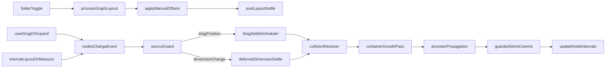

# Event-Driven Node Repulsion and Container Growth (Revised)

## Locked Product Decisions

- Use **event-driven + smooth settle** behavior (no always-on physics loop).
- Use **persistent positions** after push interactions.

## Stability and Maturity Choices

- **Phase 1 (conventional, high-stability):** deterministic hierarchical sweep resolution that reuses existing
  overlap/container patterns from the worker logic in
  `[src/client/workers/GraphLayoutWorker.ts](src/client/workers/GraphLayoutWorker.ts)`.
- **Phase 1 optional optimization (mature):** local spatial hash per sibling scope if profiling shows hot paths under
  dense drag.
- **Phase 2 (novel but mature):** quadtree acceleration for very large views only after measured need.

## Non-Negotiable Invariants

- No unintentional overlap remains inside an active sibling scope once settle completes (respecting configured gap).
- Parent containers always contain children with configured margin.
- Programmatic collision commits do not recursively retrigger the same resolver path.
- Manual push outcomes persist across local relayout events (including folder collapse/expand rebuilds) until explicit
  reset.

## Data Flow

## Implementation Steps

1. Extract shared geometry helpers (avoid duplicate math and coupling).

- Add
  `[src/client/components/DependencyGraph/layout/geometryBounds.ts](src/client/components/DependencyGraph/layout/geometryBounds.ts)`.
- Move/reuse absolute bounds resolution and dimension parsing currently duplicated in
  `[src/client/components/DependencyGraph/edgeVirtualizationCore.ts](src/client/components/DependencyGraph/edgeVirtualizationCore.ts)`
  and graph transforms.
- Keep APIs pure and deterministic for unit testing.

1. Implement deterministic hierarchical collision engine.

- Add
  `[src/client/components/DependencyGraph/layout/collisionResolver.ts](src/client/components/DependencyGraph/layout/collisionResolver.ts)`.
- Implement:
  - sibling-scope overlap detection with configurable minimum gap,
  - bounded settle loops (`maxCycles`, `maxDisplacementPerCycle`) to avoid oscillation,
  - parent growth with margin (module/package/group),
  - ancestor propagation pass so group nodes can push other group nodes at parent/root scopes,
  - conversion between absolute and parent-relative positions for store writes.
- Mirror existing proven expansion ordering principles from
  `[src/client/workers/GraphLayoutWorker.ts](src/client/workers/GraphLayoutWorker.ts)` (bottom-up before sibling push).

1. Add persistent manual-offset overlay model.

- Extend `[src/client/stores/graphStore.ts](src/client/stores/graphStore.ts)` with `manualOffsetsByNodeId` and explicit
  actions:
  - set/merge offsets from resolver output,
  - apply offsets to layout result nodes,
  - clear offsets on explicit layout reset or semantic graph identity change.
- In `[src/client/components/DependencyGraph/index.vue](src/client/components/DependencyGraph/index.vue)`, apply offsets
  after each `processGraphLayout` result commit so folder toggles and rebuilds preserve user-adjusted pushed positions.
- Keep persistence scope local to current graph identity by default; do not leak offsets to unrelated graph snapshots.

1. Wire a safe event pipeline with reentrancy protection.

- Update `handleNodesChange` in
  `[src/client/components/DependencyGraph/index.vue](src/client/components/DependencyGraph/index.vue)`:
  - add guard flags for resolver-applied commits (`isApplyingCollisionResolution`),
  - skip/queue during layout measurement (`isLayoutPending` or `isLayoutMeasuring`),
  - classify events by source (`position.dragging`, `position.drag-end`, `dimensions`),
  - settle via frame scheduler (drag) and deferred scheduler (dimensions), then single batched store write.
- Keep `reconcileSelectedNodeAfterStructuralChange` behavior unchanged.

1. Add concrete performance thresholds and degradation policy.

- Add constants in `[src/client/components/DependencyGraph/index.vue](src/client/components/DependencyGraph/index.vue)`
  (or a dedicated config module), for example:
  - `LIVE_SETTLE_NODE_THRESHOLD = 350`,
  - `LIVE_SETTLE_MIN_INTERVAL_MS = 32`,
  - `DRAG_END_ONLY_THRESHOLD = 700`.
- Policy:
  - below threshold: live settle while dragging,
  - above threshold: settle on drag-end plus deferred dimension settles,
  - always bounded iterations in resolver.
- Measure via existing FPS instrumentation before enabling broader defaults.

1. Implement container size animation and accessibility safeguards.

- Animate actual sizing surfaces used by VueFlow node rendering in
  `[src/client/components/DependencyGraph/index.vue](src/client/components/DependencyGraph/index.vue)` and container
  visuals in:
  - `[src/client/components/DependencyGraph/nodes/BaseNode.vue](src/client/components/DependencyGraph/nodes/BaseNode.vue)`
  - `[src/client/components/DependencyGraph/nodes/GroupNode.vue](src/client/components/DependencyGraph/nodes/GroupNode.vue)`
- Preserve existing collapsible content timing in:
  - `[src/client/components/DependencyGraph/nodes/CollapsibleSection.vue](src/client/components/DependencyGraph/nodes/CollapsibleSection.vue)`
  - `[src/client/components/DependencyGraph/nodes/SymbolCardSection.vue](src/client/components/DependencyGraph/nodes/SymbolCardSection.vue)`
- Add `@media (prefers-reduced-motion: reduce)` overrides for transform and size transitions to meet WCAG motion
  guidance.

1. Add unit and integration tests for correctness and loop safety.

- Add
  `[src/client/components/DependencyGraph/__tests__/collisionResolver.test.ts](src/client/components/DependencyGraph/__tests__/collisionResolver.test.ts)`:
  - drag overlap push,
  - expand/dimension collision push,
  - group-vs-group push with ancestor propagation,
  - container growth margin and clamp behavior,
  - deterministic output under fixed input ordering.
- Add tests for shared geometry helpers (adjacent to existing edge virtualization tests).
- Add interaction-level tests (new test file under `__tests__`) for:
  - no recursive resolver loop when dimension updates fire,
  - persistence of pushed positions across folder collapse/expand relayout,
  - threshold fallback behavior on dense graphs.

## Performance and Risk Controls

- Use bounded loops and displacement caps (`maxCycles`, `maxDisplacementPerCycle`) to avoid oscillation.
- Restrict collision checks to affected scopes first (changed sibling scope + propagated ancestor scopes), not full
  graph by default.
- Guarantee one batched store commit per settle operation to minimize reactive churn.
- Gate resolver during layout/measurement transactions and during internal collision-commit replay.
- Degrade to drag-end-only settling when node count exceeds configured thresholds.

## Rollout Sequence

1. Shared geometry extraction + resolver unit tests.
2. Safe event pipeline with guards and no-op mode telemetry.
3. Enable collision writes for drag-end only.
4. Enable live drag settle under threshold.
5. Add animation/reduced-motion refinements.
6. Expand test matrix and tune thresholds from measured FPS.
