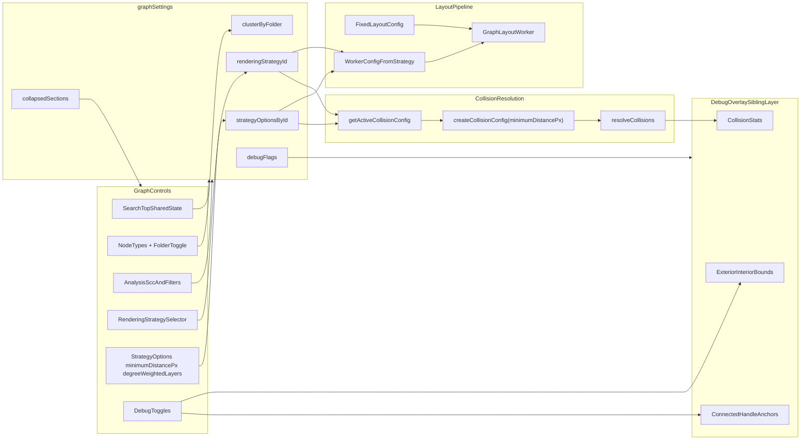

# Node Overlap Fix, GraphControls Overhaul, and Debug Tools (Final Revision)

## 1. GraphControls Changes

### 1.1 Remove Layout Algorithm and related code (deprecated)

- **[GraphControls.vue](src/client/components/GraphControls.vue)**: Remove "Layout Algorithm", "Layout Direction",
  standalone "Spacing", and standalone "Degree-Weighted Layers". Remove refs/handlers tied only to those controls and
  remove emits `layout-change`, `reset-layout`, and `reset-view`.
- **[DependencyGraph.vue](src/client/components/DependencyGraph.vue)**: Remove `@layout-change`, `@reset-layout`, and
  `@reset-view` bindings and related props/handlers.
- **[useDependencyGraphCore.ts](src/client/composables/useDependencyGraphCore.ts)**: Remove `handleLayoutChange`,
  `handleResetLayout`, and `handleResetView` from return types and implementation.
- **Behavior guardrail**: Because `handleResetView` currently sets camera mode to free, add
  `interaction.setCameraMode('free')` to `onPaneClick` alongside `setSelectedNode(null)` so removing the button does not
  strand users in a constrained camera mode.
- **[useGraphLayout.ts](src/client/composables/useGraphLayout.ts)**: Remove `setLayoutConfig`, `resetLayoutConfig`, and
  `SetLayoutConfig` from the composable contract. Keep `layoutConfig` returned read-only for internal consumers
  (including isolation behavior).

### 1.2 Freeze layout defaults (no user controls)

- **[layout/config.ts](src/client/layout/config.ts)**: Freeze algorithm/direction/spacing at stable defaults (currently
  layered/LR with existing spacing baselines) and remove user mutability.
- **ELK layout spacing stays separate from collision spacing**: ELK spacing (`nodeSpacing`, `rankSpacing`,
  `edgeSpacing`) controls initial worker placement. Collision distance controls post-layout overlap settling. Do not
  couple these knobs.
- **Direction remains internally consumed** by [useIsolationMode.ts](src/client/composables/useIsolationMode.ts), but
  there is no direction UI.

### 1.3 Strategy-provided options (spacing, degree-weighted layers)

- **[strategyRegistry.ts](src/client/rendering/strategyRegistry.ts)**:
  - Add `degreeWeightedLayers` boolean option for `canvas` and `vueflow` (default false).
  - Add `minimumDistancePx` number option for `folderDistributor` (`default: 40`, `min: 20`, `max: 100`, `step: 5`).
  - Ensure these options are represented in `createDefaultStrategyOptionsById`.
- **[graphSettings.ts](src/client/stores/graphSettings.ts) migration order**:
  1. Read parsed payload.
  2. If legacy `parsed.degreeWeightedLayers` is boolean, inject that value into `canvas` and `vueflow` entries of the
     object to be sanitized.
  3. Call `sanitizeStrategyOptionsById` on the merged object.
  4. Persist without standalone `degreeWeightedLayers` going forward.
- **[useGraphLayout.ts](src/client/composables/useGraphLayout.ts)**:
  - Source worker config `degreeWeightedLayers` from active strategy options.
  - Update layout cache key to use the same strategy-derived value (not the deprecated standalone field).
- **GraphControls rendering**: `degreeWeightedLayers` appears only via strategy option rendering
  (`activeRenderingOptions`), never as a standalone section.

### 1.4 Folders as a node type (strategy-aware)

- **[RenderingStrategy.ts](src/client/rendering/RenderingStrategy.ts)**: Add `forcesClusterByFolder: boolean` to
  `RenderingStrategyRuntime`.
  - `folderDistributor`: `true`
  - `canvas` and `vueflow`: `false`
- **Folder toggle semantics (critical correction)**:
  - Do **not** add `'group'` to `enabledNodeTypes` filtering.
  - Keep Folder as a dedicated control in the Node Types section that calls existing cluster handlers
    (`handleClusterByFolderToggle` / `setClusterByFolder`).
  - This avoids conflating node-type filtering with clustering semantics.
- **[GraphControls.vue](src/client/components/GraphControls.vue)**:
  - Display "Folder" alongside node-type controls using stable labels (use `nodeTypeLabels` map).
  - If `runtime.forcesClusterByFolder` is true, force-check and disable Folder toggle with explanatory text.
- **Behavior model**:
  - In overview strategies, Folder toggle controls `clusterByFolder` behavior.
  - In folderDistributor, graph building always clusters; Folder toggle is informative/locked.
- **Remove Clustering section**: Move Folder toggle into Node Types and move SCC into Analysis.

### 1.5 Collapse Cycles in Analysis

- **[GraphControls.vue](src/client/components/GraphControls.vue)**: Move SCC toggle into Analysis section (with test
  file/orphan analysis controls). Remove Clustering section.
- **Disable logic**: SCC is disabled when `clusterByFolder === true || runtime.forcesClusterByFolder === true`.

### 1.6 Collapsible sections in Graph Controls

- **[GraphControls.vue](src/client/components/GraphControls.vue)**: Wrap sections in collapsible wrappers with
  keyboard-accessible headers and `aria-expanded`.
- **Search remains pinned and always expanded** at panel top.
- **Canonical persisted keys**:
  - `nodeTypes`, `renderingStrategy`, `analysis`, `moduleSections`, `memberDisplay`, `relationshipTypes`, `performance`,
    `debug`
- **[graphSettings.ts](src/client/stores/graphSettings.ts)**:
  - Add `collapsedSections?: Record<string, boolean>` to persisted type.
  - On load, accept known keys only; ignore unknown keys for forward/backward compatibility.
  - Default to expanded when key missing.

### 1.7 Remove Reset Layout / Reset View

- Covered in 1.1.
- Final behavior: no reset buttons; pane click handles deselection and frees camera mode.

### 1.8 Move "Search Nodes" to top of Graph Controls

- **Shared-state requirement (critical correction)**: `useGraphSearch` must be a single shared state source (Pinia store
  or singleton-scoped composable) so GraphControls and DependencyGraph observe the same `searchQuery`/`searchResults`.
- **[GraphControls.vue](src/client/components/GraphControls.vue)**: Render search input/button at top of panel and bind
  to shared search state.
- **[DependencyGraph.vue](src/client/components/DependencyGraph.vue)**: Remove standalone search panel; consume shared
  search state and forward result changes to `handleSearchResult`.
- **[GraphSearch.vue](src/client/components/GraphSearch.vue)**: Optional thin wrapper only; avoid duplicate independent
  refs.

---

## 2. Folder Node and Overlap Behavior

### 2.1 Minimum distance for collision resolution (NOT ELK layout)

- **Scope boundary**: `minimumDistancePx` affects collision only (`overlapGap` + `groupPadding`), not ELK worker
  spacing.
- **[collisionResolver.ts](src/client/layout/collisionResolver.ts)**:
  - Add `createCollisionConfig(minimumDistancePx: number): CollisionConfig`.
  - `overlapGap = minimumDistancePx`
  - `groupPadding = { horizontal: minimumDistancePx, top: minimumDistancePx, bottom: minimumDistancePx }`
  - Keep `modulePadding`, `maxCycles`, and `maxDisplacementPerCycle` unchanged.
- **Shared config source**:
  - Add `getActiveCollisionConfig(renderingStrategyId, strategyOptionsById)` in a shared location (resolver module or
    composable helper).
  - Use this function in both collision resolution and debug overlay to avoid visual/behavior drift.
- **[useCollisionResolution.ts](src/client/composables/useCollisionResolution.ts)**:
  - Extend options to include `renderingStrategyId` and `strategyOptionsById` (or a pre-resolved `minimumDistancePx`
    ref).
  - Replace hardcoded `DEFAULT_COLLISION_CONFIG` with active config from shared source.
- **[useDependencyGraphCore.ts](src/client/composables/useDependencyGraphCore.ts)**:
  - Pass strategy id/options into `useCollisionResolution` invocation.
- **Note on constants**: Collision `groupPadding` may differ from edge routing exclusion constants. Keep systems
  independent in this phase.

### 2.2 Folder nodes grow when nodes get close to edge

- **Already implemented**: `expandParentsBottomUp()` expands parent bounds to include children plus padding.
- Once `groupPadding` is strategy-driven, folders expand when children approach folder edges by the configured minimum
  distance.

### 2.3 Folders push other folders / nodes push nodes and folder bounds

- **Already implemented**: `repelSiblings()` pushes overlapping siblings in each scope, including root-level folders in
  `__root__`.
- No algorithm rewrite required; this phase is config wiring and verification.

### 2.4 Collision resolution runs for all strategies (correction)

- Collision resolution is not gated by `clusterByFolder`; existing behavior already runs across strategies.
- Keep this as an explicit non-goal to avoid introducing unnecessary gating logic.

---

## 3. Debug Tools

### 3.1 Collision bounding boxes

- **New component**: [DebugBoundsOverlay.vue](src/client/components/DebugBoundsOverlay.vue), rendered as a sibling
  absolute overlay to VueFlow (same model as [CanvasEdgeLayer.vue](src/client/components/CanvasEdgeLayer.vue)).
- **Coordinate model**:
  - Compute graph-space bounds via existing geometry helpers.
  - Convert to screen-space using viewport transform (`x`, `y`, `zoom`) from core state.
  - Avoid reliance on private VueFlow internal pane slots.
- **Toggle**: Add persisted `showDebugBounds` in [graphSettings.ts](src/client/stores/graphSettings.ts).
- **What it draws**:
  - Node exterior bounds.
  - Folder exterior and interior bounds (interior computed from active collision config `groupPadding`).
- **Performance**:
  - Add viewport intersection culling for off-screen bounds.
  - Keep overlay `pointer-events: none`.

### 3.2 Show handles

- **Toggle**: Add persisted `showDebugHandles` in [graphSettings.ts](src/client/stores/graphSettings.ts).
- **Implementation (preferred)**:
  - Use [handleAnchors.ts](src/client/layout/handleAnchors.ts) `getHandleAnchor` from node bounds + edge handle IDs.
  - Draw anchor points for connected handles from rendered edges.
  - Avoid DOM-querying `.vue-flow__handle` so behavior remains stable with virtualized/off-screen nodes.

### 3.3 Other debug recommendations

- **Resolver stats**: expose `lastCollisionResult` from
  [useCollisionResolution.ts](src/client/composables/useCollisionResolution.ts) and render cycles/converged status when
  debug is enabled.
- **Node IDs**: optional `showDebugNodeIds` toggle for text labels.
- **Active strategy summary**: in Debug controls show strategy id + active `minimumDistancePx` + effective overlap gap.

---

## 4. Implementation order (revised based on dependency analysis)

1. **Strategy/runtime foundations + migration (atomic)**:

- Add `forcesClusterByFolder` runtime field.
- Add strategy options (`degreeWeightedLayers`, `minimumDistancePx`) and defaults.
- Migrate legacy `degreeWeightedLayers` in `loadSettings` before sanitize.
- Switch `useGraphLayout` consumer + cache key to strategy-derived DWL in same change.

1. **Control removal + behavior preservation**:

- Remove deprecated layout/reset controls from UI and handlers.
- Add pane-click camera reset safeguard.
- Reorganize Folder/SCC controls with corrected semantics.

1. **Collision config wiring**:

- Add `createCollisionConfig` + shared active-config resolver.
- Extend `useCollisionResolution` options and pass strategy data from core.
- Verify folder expansion and root-scope sibling repulsion.

1. **Search + collapsible controls**:

- Introduce shared `useGraphSearch`.
- Move search UI to top.
- Add collapsible sections with canonical persisted IDs.

1. **Debug overlays**:

- Add debug toggles, bounds overlay, handle anchor overlay, and resolver stats.

1. **Tests/verification pass**:

- Update and add unit/e2e coverage listed in section 6 before completion.

---

## 5. Files to touch (summary)

- **GraphControls UI**: [GraphControls.vue](src/client/components/GraphControls.vue)
- **DependencyGraph wiring**: [DependencyGraph.vue](src/client/components/DependencyGraph.vue)
- **Core handlers**: [useDependencyGraphCore.ts](src/client/composables/useDependencyGraphCore.ts)
- **Layout config / defaults**: [layout/config.ts](src/client/layout/config.ts),
  [useGraphLayout.ts](src/client/composables/useGraphLayout.ts)
- **Strategy types + registry**: [RenderingStrategy.ts](src/client/rendering/RenderingStrategy.ts),
  [strategyRegistry.ts](src/client/rendering/strategyRegistry.ts)
- **Collision + minimum distance**: [collisionResolver.ts](src/client/layout/collisionResolver.ts),
  [useCollisionResolution.ts](src/client/composables/useCollisionResolution.ts)
- **Search refactor**: [GraphSearch.vue](src/client/components/GraphSearch.vue), new
  [useGraphSearch.ts](src/client/composables/useGraphSearch.ts), GraphControls, DependencyGraph
- **Store updates**: [graphSettings.ts](src/client/stores/graphSettings.ts) (collapsedSections, debug toggles,
  migration)
- **Debug overlay**: new [DebugBoundsOverlay.vue](src/client/components/DebugBoundsOverlay.vue)
- **Potential helper**: shared active collision config helper in
  [collisionResolver.ts](src/client/layout/collisionResolver.ts) or
  [useCollisionResolution.ts](src/client/composables/useCollisionResolution.ts)
- **Tests**:
  - [graphSettingsRenderingStrategy.test.ts](src/client/stores/__tests__/graphSettingsRenderingStrategy.test.ts)
  - [collisionResolver.test.ts](src/client/layout/__tests__/collisionResolver.test.ts)
  - [renderingStrategyRegistry.test.ts](src/client/__tests__/renderingStrategyRegistry.test.ts)
  - [graph-interaction.spec.ts](tests/e2e/graph-interaction.spec.ts)

---

## 6. Testing Additions (must-have)

1. **Graph settings migration/persistence**

- Legacy `degreeWeightedLayers` migrates to strategy options for `canvas` and `vueflow`.
- `collapsedSections` persists and hydrates with unknown-key tolerance.
- `showDebugBounds`, `showDebugHandles`, and optional `showDebugNodeIds` persist/hydrate.

1. **Strategy registry options**

- Defaults contain `degreeWeightedLayers` for supported strategies and `minimumDistancePx` for folderDistributor.
- Sanitize path preserves valid values and clamps out-of-range `minimumDistancePx`.

1. **Collision config**

- `createCollisionConfig(minimumDistancePx)` sets `overlapGap` and `groupPadding` correctly for multiple values.
- `useCollisionResolution` consumes active config (not hardcoded default).

1. **GraphControls / E2E**

- No layout algorithm/direction/reset buttons.
- Search appears at top of controls.
- Folder control exists in Node Types, and is checked+disabled when strategy forces clustering.
- SCC appears in Analysis and obeys disable logic (`clusterByFolder || forcesClusterByFolder`).
- At least one collapsible section expand/collapse flow is validated.

1. **Debug overlays**

- Bounds overlay appears when toggled.
- Handle anchors render for connected handles when toggled.
- Resolver stats badge updates after collision runs.

---

## 7. Diagram: Control, strategy, and collision flow

