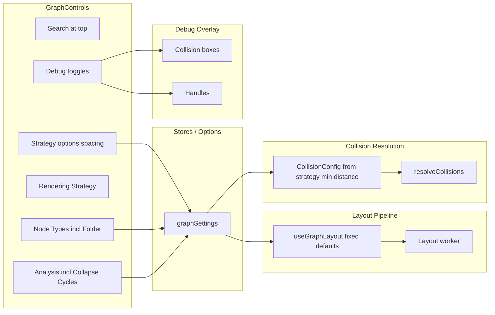

# Node Overlap Fix, GraphControls Overhaul, and Debug Tools

## 1. GraphControls Changes

### 1.1 Remove Layout Algorithm and related code (deprecated)

- **[GraphControls.vue](src/client/components/GraphControls.vue)**: Remove the entire "Layout Algorithm" section (lines ~~388–406), the "Layout Direction" section (~~408–427), the "Degree-Weighted Layers" block (~~429–443), and the standalone "Spacing" section (~~445–475). Remove refs `layoutAlgorithm`, `layoutDirection`, `nodeSpacing`, `rankSpacing` and handlers `handleAlgorithmChange`, `handleDirectionChange`, `handleSpacingChange`, `handleResetLayout` (and its reset of those refs). Remove emits `reset-layout`, `reset-view`, `layout-change`.
- **[DependencyGraph.vue](src/client/components/DependencyGraph.vue)**: Remove `@layout-change`, `@reset-layout`, `@reset-view` and the corresponding handler bindings.
- **[useDependencyGraphCore.ts](src/client/composables/useDependencyGraphCore.ts)**: Remove `handleLayoutChange`, `handleResetLayout`, `handleResetView` from the composable return and from the interface; remove their implementations. Layout will be driven by fixed defaults and strategy options only (see 1.2).
- **Layout pipeline**: Keep a single internal layout config in [useGraphLayout.ts](src/client/composables/useGraphLayout.ts) and [layout/config.ts](src/client/layout/config.ts). Do not remove `LayoutConfig` or the worker’s use of algorithm/direction—instead, stop exposing them in the UI. Use fixed defaults: e.g. `algorithm: 'layered'`, a single "compact" default direction (e.g. `LR` or `TB` with tighter defaults in [config.ts](src/client/layout/config.ts) such as `nodeSpacing: 60`, `rankSpacing: 120`). No more `setLayoutConfig`/`resetLayoutConfig` calls from UI; optionally keep them for programmatic use or remove if unused.

### 1.2 Spacing controls from RenderingStrategy

- **[RenderingStrategy.ts](src/client/rendering/RenderingStrategy.ts)**: No type changes required; options already support `number` and predicates.
- **[strategyRegistry.ts](src/client/rendering/strategyRegistry.ts)**: For `folderDistributor` (and optionally `canvas`/`vueflow`), add `RenderingNumberOptionDefinition` options, e.g. `nodeSpacing` (min/max/step) and `rankSpacing` (or a single `minimumDistancePx` used for both node–node and node–folder). Document that these feed layout and collision.
- **GraphControls**: Spacing is already rendered via `activeRenderingOptions`; once the standalone Spacing section is removed, the only spacing controls will be those defined on the active strategy. Ensure [useGraphLayout.ts](src/client/composables/useGraphLayout.ts) (and the layout worker config) and [useCollisionResolution.ts](src/client/composables/useCollisionResolution.ts) read spacing/minimum distance from strategy options (from `graphSettings.strategyOptionsById[strategyId]`) or from a shared source (e.g. a getter that combines strategy options with layout config defaults).

### 1.3 Folders as a node type

- **[GraphControls.vue](src/client/components/GraphControls.vue)**: Add `'group'` (or `'folder'`) to the `nodeTypes` list used for the Node Types filter (e.g. `['module', 'class', 'interface', 'package', 'group']` with label "Folder" for `group`). Ensure `graphSettings.enabledNodeTypes` can include `'group'`.
- **Semantics**: When "Folder" is unchecked, do not create or show folder (group) nodes: treat as "flat" view. Easiest approach: map "Folder" checkbox to existing `clusterByFolder` (when Folder is unchecked, set `clusterByFolder` false; when checked, set true). So the Clustering section loses the "Cluster by folder" checkbox and the Node Types section gains "Folder" which toggles `clusterByFolder`. Persist via existing `clusterByFolder` in [graphSettings.ts](src/client/stores/graphSettings.ts). If you prefer to keep both "Cluster by folder" and "Folder" as separate concepts, then `enabledNodeTypes` would include `'group'` and graph build would filter out group nodes when `'group'` is not in `enabledNodeTypes` (and unparent their children); that is a larger change and can be a follow-up.

### 1.4 Collapse Cycles in Analysis

- **[GraphControls.vue](src/client/components/GraphControls.vue)**: Move the "Collapse cycles (SCC)" checkbox from the Clustering section into the existing "Analysis" section (with "Hide test files" and "Highlight global orphans"). Remove or simplify the Clustering section (if only "Cluster by folder" remains and that is moved to Node Types as "Folder", the Clustering block can be removed).

### 1.5 Layout direction more compact

- **[layout/config.ts](src/client/layout/config.ts)**: Set default `direction` and spacing to a denser default (e.g. `nodeSpacing: 60`, `rankSpacing: 120`, keep `direction: 'LR'` or choose `'TB'` if that is more compact for your content). No UI for direction; single compact default.

### 1.6 Collapsible sections in Graph Controls

- **[GraphControls.vue](src/client/components/GraphControls.vue)**: Wrap each logical section (Search, Node Types, Relationship Types, Rendering Strategy, Analysis, Module Sections, Member Display, Performance, etc.) in a collapsible wrapper: a clickable header (e.g. section title + chevron) and a toggle that shows/hides the section body. Use a local ref or a small store keyed by section id (e.g. `sectionCollapsed['analysis']`) so state is optional to persist. Ensure accessibility (aria-expanded, focus management).

### 1.7 Remove Reset Layout / Reset View

- Already covered in 1.1: remove the two buttons and their handlers/emits.

### 1.8 Move "Search Nodes" to top of Graph Controls

- **[DependencyGraph.vue](src/client/components/DependencyGraph.vue)**: Remove the standalone `<GraphSearch>` panel (or keep the component but slot it inside GraphControls). **[GraphControls.vue](src/client/components/GraphControls.vue)**: Add Search at the very top of the panel: either embed the search input + button (and reuse GraphSearch logic via a shared composable or inline) or use a slot/prop to render GraphSearch as the first child. Ensure `search-result` is emitted upward so DependencyGraph still receives it and can call `handleSearchResult`. GraphSearch currently lives in its own Panel (top-right); it will become the first section inside the left GraphControls panel.

---

## 2. Folder Node and Overlap Behavior

### 2.1 Single minimum distance (nodes and folders)

- **[RenderingStrategy](src/client/rendering/RenderingStrategy.ts) / [strategyRegistry**](src/client/rendering/strategyRegistry.ts): For `folderDistributor`, add a number option e.g. `minimumDistancePx` (default e.g. 40) used for both node–node gap and folder interior margin.
- **[collisionResolver.ts](src/client/layout/collisionResolver.ts)**: Extend `CollisionConfig` so that one value drives both: e.g. `minimumDistancePx` used for `overlapGap` and for `groupPadding` (and optionally `modulePadding` for consistency). So `overlapGap = config.minimumDistancePx`, `groupPadding = { horizontal, top, bottom } = minimumDistancePx`. Replace or derive `DEFAULT_COLLISION_CONFIG` from that single value. Keep `modulePadding` for now unless you want the same value there too.
- **[useCollisionResolution.ts](src/client/composables/useCollisionResolution.ts)**: Build `CollisionConfig` from strategy options (and current strategy id) when in Folder View: read `minimumDistancePx` from `graphSettings.strategyOptionsById['folderDistributor']` and pass it into `resolveCollisions`. For non–folder strategies, use a default (e.g. 40).

### 2.2 Folder nodes grow when nodes get close to edge

- **[collisionResolver.ts](src/client/layout/collisionResolver.ts)**: Already has `expandParentsBottomUp()` which grows parent size to contain children with padding. Ensure group (folder) padding uses the same `minimumDistancePx` so that when a node is near the folder edge, the next resolve cycle expands the folder (parent) so the child stays at least `minimumDistancePx` from the folder boundary. No change if already satisfied; otherwise ensure padding used for group expansion equals the configured minimum distance.

### 2.3 Folders push other folders / nodes push nodes and folder bounds

- **[collisionResolver.ts](src/client/layout/collisionResolver.ts)**: Already resolves sibling overlaps (nodes and groups) via `repelSiblings()` and expands parents. Root-level siblings include folder (group) nodes; so folder–folder pushing is already in scope. Verify that root-level group nodes are in the same sibling set and get repulsion; ensure `affectedScopes` includes `__root__` when resolving so root-level folders push each other. If not, extend so that root siblings are resolved with the same `overlapGap` (minimum distance).

### 2.4 Apply collision resolution in Folder View

- **[useCollisionResolution.ts](src/client/composables/useCollisionResolution.ts)**: Collision resolution is already gated by `clusterByFolder`. Ensure when strategy is `folderDistributor` (and thus folder clustering is effectively always on), collision resolution runs and uses the strategy-provided `minimumDistancePx`. If the composable currently only runs when `clusterByFolder` is true, keep that; ensure folderDistributor build path sets or implies clusterByFolder so resolution always runs in Folder View.

---

## 3. Debug Tools

### 3.1 Collision bounding boxes

- **New debug overlay**: Add a toggle (e.g. in GraphControls under a "Debug" collapsible section, or via a query param like `?debugBounds=1`) that enables drawing of:
  - **Nodes**: exterior bounding box (rectangle) around each node using current dimensions (from node style or measured).
  - **Folders (groups)**: interior bound (content area after padding) and exterior bound (full group size). Use the same padding values as in [collisionResolver](src/client/layout/collisionResolver.ts) (e.g. `groupPadding`).
- **Implementation**: Either a dedicated overlay layer (e.g. a Vue component that subscribes to `nodes` and draws SVG/divs over the graph) or per-node wrappers that render a debug outline when a global `showDebugBounds` ref is true. Prefer one overlay layer that iterates nodes and groups and draws rectangles in screen or flow coordinates so it doesn’t alter node DOM.

### 3.2 Show handles

- **Handles**: Vue Flow nodes can expose handle positions (source/target). Add a debug toggle "Show handles" that visualizes handle locations (e.g. small circles or crosses at handle positions) for each node. Use Vue Flow’s handle selectors or node data to get positions and draw them in the same overlay as 3.1 or a second overlay.

### 3.3 Other debug recommendations

- **Layout / position history**: Optional log or overlay of last applied layout step (e.g. "Resolved in N cycles") for collision resolver.
- **Node / folder IDs**: Optional labels on nodes and folders (e.g. small text with `node.id`) when debug is on.
- **Minimum distance ruler**: Optional line or gap indicator showing the configured `minimumDistancePx` between two nodes or from node to folder edge.
- **Strategy and options**: In the Debug section, show current `renderingStrategyId` and the active strategy’s option values (read-only) to verify what’s driving layout and collision.

---

## 4. Implementation order (suggested)

1. **Unify minimum distance and collision config** (2.1, 2.2, 2.3): Add `minimumDistancePx` to strategy options and collision config; wire useCollisionResolution to use it; verify folder expansion and root-level folder pushing.
2. **GraphControls removals and moves** (1.1, 1.4, 1.7, 1.5): Remove Layout Algorithm, Layout Direction, Degree-Weighted Layers, standalone Spacing, Reset Layout/View; move Collapse Cycles to Analysis; lock layout defaults to compact in config.
3. **Strategy spacing and Folder as node type** (1.2, 1.3): Add spacing/minimum-distance options to folderDistributor (and optionally others); add Folder to Node Types and tie it to clusterByFolder; remove redundant Clustering section if applicable.
4. **Search at top and collapsible sections** (1.8, 1.6): Move GraphSearch into GraphControls at top; make all sections collapsible.
5. **Debug tools** (3.1, 3.2, 3.3): Add Debug section with toggles for collision boxes and handles; implement overlay(s); add optional ID labels and strategy summary.

---

## 5. Files to touch (summary)

| Area                         | Files                                                                                                                                         |
| ---------------------------- | --------------------------------------------------------------------------------------------------------------------------------------------- |
| GraphControls UI             | [GraphControls.vue](src/client/components/GraphControls.vue)                                                                                  |
| DependencyGraph wiring       | [DependencyGraph.vue](src/client/components/DependencyGraph.vue)                                                                              |
| Core handlers                | [useDependencyGraphCore.ts](src/client/composables/useDependencyGraphCore.ts)                                                                 |
| Layout config / defaults     | [layout/config.ts](src/client/layout/config.ts), [useGraphLayout.ts](src/client/composables/useGraphLayout.ts)                                |
| Strategy options             | [strategyRegistry.ts](src/client/rendering/strategyRegistry.ts)                                                                               |
| Collision & minimum distance | [collisionResolver.ts](src/client/layout/collisionResolver.ts), [useCollisionResolution.ts](src/client/composables/useCollisionResolution.ts) |
| Search placement             | [GraphSearch.vue](src/client/components/GraphSearch.vue) (possibly refactor for embedding), GraphControls + DependencyGraph                   |
| Debug overlay                | New component(s) + Debug section in GraphControls (and optional query param)                                                                  |
| Store                        | [graphSettings.ts](src/client/stores/graphSettings.ts) only if new persisted state for debug or section collapse                              |

---

## 6. Diagram: Control and layout flow after changes

