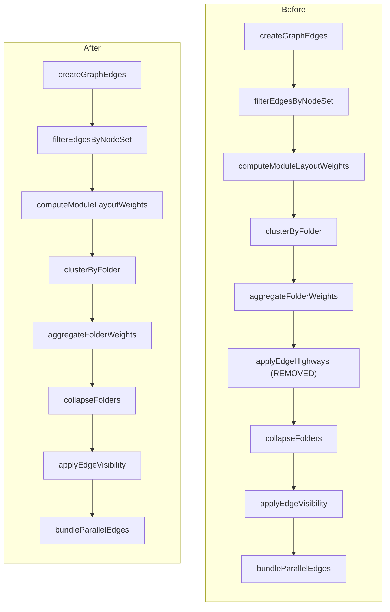

# Remove Highway Edge Aggregation

**Goal:** Eliminate the exit/trunk/entry highway edge system so all edges are direct module-to-module connections that
visually cross folder group boundaries. Folders remain as visual containers with import-balance weighted ordering
(foundations left, consumers right).

**Key insight:** Vue Flow natively routes edges between child nodes across group boundaries -- the highway system was an
app-layer optimization, not a framework requirement. Removing it means edges go `moduleA -> moduleB` directly using
`relational-out` / `relational-in` handles, even when the modules are in different folders.

---

## What gets deleted

- `**applyEdgeHighways` function and all highway accumulator logic in
  [src/client/graph/transforms/edgeHighways.ts](src/client/graph/transforms/edgeHighways.ts) -- the entire function that
  splits cross-folder edges into exit/trunk/entry segments
- `**optimizeHighwayHandleRouting` function in the same file -- the layout-pass that rewrites highway handle IDs
- **Folder handles** in [src/client/components/nodes/GroupNode.vue](src/client/components/nodes/GroupNode.vue) -- all
  four `folder-left-in`, `folder-left-in-inner`, `folder-right-out`, `folder-right-out-inner` handles and their CSS
- `**FOLDER_HANDLE_IDS`** and `**FOLDER_INNER_HANDLE_IDS` from
  [src/client/graph/handleRouting.ts](src/client/graph/handleRouting.ts)
- **Highway-specific test cases** in `edgeHighways.test.ts`, and highway assertions in `buildOverviewGraph.test.ts`,
  `collapseFolders.test.ts`, `graphViewShared.test.ts`

## What gets simplified

- `**buildOverviewGraph.ts` pipeline: skip the `applyEdgeHighways` call entirely; pass clustered edges straight through
  to visibility/bundling
- `**useGraphLayout.ts` `normalizeLayoutResult`: remove the `optimizeHighwayHandleRouting` call; edges just get handle
  positions from nodes
- `**useIsolationMode.ts`: remove the `applyEdgeHighways` call from the isolation pipeline
- `**collapseFolders.ts`: remove the highway segment special case (lines 101-106); collapsed folders just remap module
  edges to folder endpoints with normal dedup
- `**graphViewShared.ts` `bundleParallelEdges`: remove the `highwaySegment === 'highway'` skip-bundling exception
- `**GraphEdgeData.ts`: remove the five highway optional fields (`highwaySegment`, `highwayCount`, `highwayTypes`,
  `highwayGroupId`, `highwayTypeBreakdown`)
- `**handleAnchors.ts`: remove the folder handle anchor patterns (only `relational-in`/`relational-out` remain)

## What stays unchanged

- `**computeModuleLayoutWeights`** and `**aggregateFolderWeights\*\`in`buildOverviewGraph.ts` -- weighting logic is
  independent of highways
- `**simpleHierarchicalLayout.ts` -- layout ordering by `layoutWeight` is unaffected
- `**BaseNode.vue` -- `relational-in` / `relational-out` handles remain as-is
- `**clusterByFolder` in `folders.ts` -- folder grouping is visual only, unrelated to edge routing
- `**createGraphEdges` -- raw edge creation is unchanged; these are the edges that now flow through directly
- `**applyEdgeVisibility`** and `**bundleParallelEdges\*\` (minus the highway exception) -- still needed for filtering
  and dedup

## Pipeline before vs after

## Implementation steps

### Step 1: Remove highway projection from build pipelines

In [src/client/graph/buildOverviewGraph.ts](src/client/graph/buildOverviewGraph.ts):

- Remove the import of `applyEdgeHighways`
- Replace `let projectedGraph = applyEdgeHighways(...)` with passing
  `{ nodes: nodesWithFolderWeights, edges: transformedGraph.edges }` directly to the rest of the pipeline

In [src/client/composables/useIsolationMode.ts](src/client/composables/useIsolationMode.ts):

- Remove the import of `applyEdgeHighways`
- Remove the `applyEdgeHighways` call (~line 262); use the clustered edges directly

In [src/client/composables/useGraphLayout.ts](src/client/composables/useGraphLayout.ts):

- Remove the import of `optimizeHighwayHandleRouting`
- In `normalizeLayoutResult`, replace `edges: optimizeHighwayHandleRouting(nodesWithHandles, resultEdges)` with just
  `edges: resultEdges`

### Step 2: Remove highway special cases from downstream transforms

In [src/client/graph/cluster/collapseFolders.ts](src/client/graph/cluster/collapseFolders.ts):

- Delete the highway segment check at lines 101-106 (the `if ((segment === 'exit' || segment === 'entry') ...` block)

In [src/client/graph/graphViewShared.ts](src/client/graph/graphViewShared.ts):

- Delete the `if (group.some((edge) => edge.data?.highwaySegment === 'highway'))` branch in `bundleParallelEdges`

### Step 3: Remove folder handles from GroupNode

In [src/client/components/nodes/GroupNode.vue](src/client/components/nodes/GroupNode.vue):

- Remove the `folderHandles` array, the `Handle` import, and all `<Handle>` elements from the template
- Remove the `.folder-handle` and `.folder-handle-inner` CSS

### Step 4: Clean up routing helpers and types

In [src/client/graph/handleRouting.ts](src/client/graph/handleRouting.ts):

- Remove `FOLDER_HANDLE_IDS` and `FOLDER_INNER_HANDLE_IDS` exports

In [src/client/layout/handleAnchors.ts](src/client/layout/handleAnchors.ts):

- Remove the `FOLDER_HANDLE_PATTERN` regex and folder anchor branch; keep only `relational-in` / `relational-out`

In [src/shared/types/graph/GraphEdgeData.ts](src/shared/types/graph/GraphEdgeData.ts):

- Remove `highwaySegment`, `highwayCount`, `highwayTypes`, `highwayGroupId`, `highwayTypeBreakdown`

Delete [src/client/graph/transforms/edgeHighways.ts](src/client/graph/transforms/edgeHighways.ts) entirely (or gut it to
an empty module if imports are tricky to untangle).

### Step 5: Update tests

- **Delete**
  [src/client/graph/transforms/**tests**/edgeHighways.test.ts](src/client/graph/transforms/__tests__/edgeHighways.test.ts)
  entirely
- **Update**
  [src/client/graph/**tests**/buildOverviewGraph.test.ts](src/client/graph/__tests__/buildOverviewGraph.test.ts): remove
  the "produces edge highways across folder boundaries" test; verify that cross-folder edges are now direct
  module-to-module
- **Update**
  [src/client/graph/cluster/**tests**/collapseFolders.test.ts](src/client/graph/cluster/__tests__/collapseFolders.test.ts):
  remove highway-specific collapse tests
- **Update** [src/client/graph/**tests**/graphViewShared.test.ts](src/client/graph/__tests__/graphViewShared.test.ts):
  remove highway bundling exception tests
- **Update** [src/client/graph/**tests**/handleRouting.test.ts](src/client/graph/__tests__/handleRouting.test.ts):
  remove folder handle ID assertions

### Step 6: Verify

- Run `pnpm vitest run` for all affected test files
- Run `pnpm typecheck`
- Smoke test the live graph UI to confirm direct edges cross folder boundaries cleanly

## Performance note

Removing highways will increase the rendered edge count for cross-folder connections (one edge per import instead of one
aggregated trunk per folder pair). The existing `bundleParallelEdges` will still merge parallel same-source-same-target
edges when the total count exceeds 50, and `useOnlyRenderVisibleElements` in VueFlow limits DOM rendering. If edge count
becomes a visual problem, `bundleParallelEdges` is the existing mitigation and no new code is needed.
