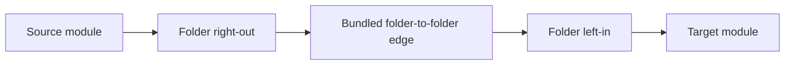

# Simplified Handle Highways Implementation Plan

> **For Claude:** REQUIRED SUB-SKILL: Use superpowers:executing-plans to implement this plan task-by-task.

**Goal:** Collapse the overview graph to one left incoming handle and one right outgoing handle per node and folder,
keep folder-level highway aggregation, and bias layout so import-heavy producers sit left of consumer-heavy nodes and
folders.

**Architecture:** Reuse the current overview pipeline in
[src/client/graph/buildOverviewGraph.ts](src/client/graph/buildOverviewGraph.ts) and
[src/client/composables/useGraphLayout.ts](src/client/composables/useGraphLayout.ts). Instead of multi-side
nearest-handle routing, convert the folder highway system in
[src/client/graph/transforms/edgeHighways.ts](src/client/graph/transforms/edgeHighways.ts) to a fixed
`module -> folder-right-out -> folder-left-in -> module` contract, and feed score metadata from semantic import edges
into [src/client/layout/simpleHierarchicalLayout.ts](src/client/layout/simpleHierarchicalLayout.ts) for stable
left-to-right ordering.

**Tech Stack:** Vue 3, Vue Flow, Vitest, existing custom graph transforms/layout.

---

**Current blocker in code:**
[src/client/layout/simpleHierarchicalLayout.ts](src/client/layout/simpleHierarchicalLayout.ts) accepts `edges` but
ignores them, so no import/consumer weighting can currently affect placement.

```162:165:src/client/layout/simpleHierarchicalLayout.ts
export function computeSimpleHierarchicalLayout(
  nodes: DependencyNode[],
  _edges: GraphEdge[]
): HierarchicalLayoutResult {
```

## Target Routing



## Implementation Steps

### 1. Canonicalize the handle model

- Modify [src/client/components/nodes/BaseNode.vue](src/client/components/nodes/BaseNode.vue) so regular nodes expose
  only `relational-in` on the left and `relational-out` on the right.
- Modify [src/client/components/nodes/GroupNode.vue](src/client/components/nodes/GroupNode.vue) so folders expose only
  `folder-left-in` and `folder-right-out`.
- Remove side-specific handle assumptions from [src/client/graph/handleRouting.ts](src/client/graph/handleRouting.ts),
  [src/client/layout/handleAnchors.ts](src/client/layout/handleAnchors.ts), and
  [src/client/layout/edgeGeometryPolicy.ts](src/client/layout/edgeGeometryPolicy.ts), keeping only the canonical
  left/right IDs plus stable anchor math.

### 2. Simplify folder highway routing without changing the high-level pipeline

- Keep the existing `exit -> highway -> entry` aggregation in
  [src/client/graph/buildOverviewGraph.ts](src/client/graph/buildOverviewGraph.ts) and
  [src/client/graph/transforms/edgeHighways.ts](src/client/graph/transforms/edgeHighways.ts).
- Replace nearest-side handle selection in
  [src/client/graph/transforms/edgeHighways.ts](src/client/graph/transforms/edgeHighways.ts) with fixed handle
  assignment:
  - exit edges: `relational-out` -> `folder-right-out`
  - trunk edges: `folder-right-out` -> `folder-left-in`
  - entry edges: `folder-left-in` -> `relational-in`
- Preserve existing aggregation counts and type breakdowns so the number of inter-folder DOM edges stays low.
- Treat [src/client/components/edges/IntraFolderEdge.vue](src/client/components/edges/IntraFolderEdge.vue) as optional
  cleanup only; do not make the plan depend on reviving that currently-unused edge type unless the simplified routing
  still looks bad in practice.

### 3. Add simple import/consumer weighting

- Compute per-module import balance from semantic import edges before highway projection in
  [src/client/graph/buildOverviewGraph.ts](src/client/graph/buildOverviewGraph.ts): `outgoingImports`,
  `incomingConsumers`, and `layoutWeight = outgoingImports - incomingConsumers`.
- Aggregate those module weights onto folder group nodes in the same file or a small helper near
  [src/client/graph/cluster/folders.ts](src/client/graph/cluster/folders.ts).
- Store the score on node `data` so layout can use it without double-counting projected `exit`, `highway`, and `entry`
  edges.

### 4. Make layout honor the weighting

- Update [src/client/layout/simpleHierarchicalLayout.ts](src/client/layout/simpleHierarchicalLayout.ts) to sort root
  folders and child modules by `layoutWeight` before grid placement.
- Keep deterministic tiebreakers to avoid jitter: existing type order, then package/path/id style fallbacks.
- Do not switch to a more complex ranking engine; the chosen approach is the high-stability, low-novelty option and
  should remain a sort-based enhancement to the current custom layout.

### 5. Cover the behavior with focused tests

- Update
  [src/client/graph/transforms/**tests**/edgeHighways.test.ts](src/client/graph/transforms/__tests__/edgeHighways.test.ts)
  to expect the fixed left/right handle contract instead of per-side routing.
- Add or update
  [src/client/graph/**tests**/buildOverviewGraph.test.ts](src/client/graph/__tests__/buildOverviewGraph.test.ts) to
  verify module and folder weights are derived from import edges.
- Update [src/client/**tests**/simpleHierarchicalLayout.test.ts](src/client/__tests__/simpleHierarchicalLayout.test.ts)
  to assert import-heavy items land left of consumer-heavy peers.
- Touch
  [src/client/composables/**tests**/useGraphLayout.test.ts](src/client/composables/__tests__/useGraphLayout.test.ts)
  only if snapshot shape or layouted node data changes.

## Verification

- Run `vitest` for:
  - `src/client/graph/transforms/__tests__/edgeHighways.test.ts`
  - `src/client/graph/__tests__/buildOverviewGraph.test.ts`
  - `src/client/__tests__/simpleHierarchicalLayout.test.ts`
  - `src/client/composables/__tests__/useGraphLayout.test.ts`
- Do one manual smoke check in the graph UI to confirm:
  - only one visible incoming and outgoing handle per node and folder
  - module-to-folder connectors converge on the shared folder handles
  - folder-to-folder highways remain aggregated
  - import-heavy folders and modules visually drift left, consumers right

## Stability Notes

- Chosen path: fixed left/right handles plus score-based sorting
  - maturity: high
  - stability: high
  - risk: mostly routing-helper cleanup and test expectation updates
- Deferred alternative: true graph-layer ranking
  - maturity in this repo: medium to novel
  - stability: lower
  - benefit: potentially better global ordering, but more invasive than needed for this simplification

---

## Tech Design Review

> Reviewed 2026-03-23. Verdict: **🟡 Revise** — two critical gaps must be closed before implementation begins.

### Critical Issues

#### C1: `optimizeHighwayHandleRouting` is not addressed and will break after Step 1

The plan only targets `applyEdgeHighways` for routing simplification, but there are **two separate routing passes** in
this pipeline:

1. `applyEdgeHighways` — data-pass, runs inside `buildOverviewGraph`, assigns initial handle IDs.
2. `optimizeHighwayHandleRouting` — geometry-pass, runs inside `useGraphLayout.ts:338` (`normalizeLayoutResult`), reads
   DOM bounds and **reassigns** side-specific handles after positions are known.

`optimizeHighwayHandleRouting` (in
[src/client/graph/transforms/edgeHighways.ts:311](src/client/graph/transforms/edgeHighways.ts#L311)) uses
`CHILD_OUT_HANDLE_BY_SIDE` / `CHILD_IN_HANDLE_BY_SIDE` maps (e.g. `relational-out-right`, `relational-out-bottom`) and
`FOLDER_INNER_OUT_HANDLE_BY_SIDE` / `FOLDER_INNER_IN_HANDLE_BY_SIDE` maps. After Step 1 strips BaseNode down to just
`relational-out` and `relational-in`, Vue Flow will fail to locate those named handles and connectors will render
incorrectly or invisibly.

**Fix:** Add an explicit sub-step under Step 2.

Since the layout is LR-only (`HARDCODED_LAYOUT_CONFIG` at `useGraphLayout.ts:185`), simplify
`optimizeHighwayHandleRouting` to assign constants instead of running geometry:

- exit edge: `sourceHandle = 'relational-out'`, `targetHandle = 'folder-right-out-inner'`
- entry edge: `sourceHandle = 'folder-left-in-inner'`, `targetHandle = 'relational-in'`
- trunk edge: `sourceHandle = 'folder-right-out'`, `targetHandle = 'folder-left-in'`

The `chooseClosestHandle` call and all four side-keyed maps can then be deleted.

#### C2: `handleAnchors.ts` bare-handle geometry points to top/bottom, not left/right

`getHandleAnchor` for the bare `relational-in` and `relational-out` IDs currently returns:

```typescript
// handleAnchors.ts:78-89 (current)
if (handleId === 'relational-in') return { x: width * 0.5, y: 0 }; // top-center
if (handleId === 'relational-out') return { x: width * 0.5, y: height }; // bottom-center
```

After canonicalization, `relational-in` is on the **left** and `relational-out` is on the **right**. If
`buildEdgePolyline` is invoked with these IDs (directly, from any custom edge component), it will infer the wrong
exit/entry side and produce malformed polylines.

**Fix:** Update these two branches in `handleAnchors.ts`:

```typescript
if (handleId === 'relational-in') return { x: 0, y: height * 0.5 }; // left-center
if (handleId === 'relational-out') return { x: width, y: height * 0.5 }; // right-center
```

Also delete the `RELATIONAL_SIDE_HANDLE_PATTERN` branch from `handleAnchors.ts` and
`edgeGeometryPolicy.ts:getHandleSide` once those side-handles are removed from `BaseNode.vue`.

### Significant Concerns

#### S1: Folder weight aggregation formula is unspecified

Step 3 says "Aggregate those module weights onto folder group nodes" without specifying the formula. Sum and mean give
very different results for large, balanced folders. Specify **sum** (total import surplus/deficit across all children)
as it scales with folder size and gives a more stable signal for ordering.

#### S2: Child-module sort is not covered by the root-node sort

Step 4 says "sort root folders and child modules by layoutWeight before grid placement." But child modules are currently
sorted by their appearance order in the `nodes` array inside `computeChildLayout`. To sort children by `layoutWeight`,
either sort each `children` array by `layoutWeight` descending before passing it to `computeChildLayout`, or sort inside
`computeChildLayout` directly.

Neither location is called out in the plan. Clarify which.

#### S3: `DependencyData` type needs a `layoutWeight` field

The plan stores `layoutWeight` on `node.data`, but `DependencyData` is a shared type. Add `layoutWeight?: number` to the
`DependencyData` interface in `src/shared/types/graph/DependencyData.ts` (or wherever it is defined) before Step 3.
Without this, TypeScript will reject the assignment and tests won't compile.

#### S4: Two existing tests must be **deleted**, not updated

- `edgeHighways.test.ts` line 163 — "chooses nearest handles and allows multiple outgoing handles per module" —
  validates the geometry behavior being removed. After Step 1/2, a module can only have one outgoing handle, so the
  scenario (A→B and A→C using different sides) is no longer meaningful. **Delete this test.**
- `edgeHighways.test.ts` line 112-113 — asserts `trunk.sourceHandle = 'folder-bottom-out'` and
  `trunk.targetHandle = 'folder-top-in'` for `direction: 'TB'`. After simplification, direction no longer affects handle
  IDs. **Delete or replace with an LR-only assertion.**

The plan's Step 5 note to "update" tests understates this; these tests specifically validate the capability being
removed.

#### S5: `useGraphLayout.test.ts` will **definitely** change

Step 5 says "touch `useGraphLayout.test.ts` only if snapshot shape or layouted node data changes." Because
`layoutWeight` is being added to `node.data`, snapshots will change. Treat this test file as **required** to update, not
optional.

#### S6: `direction` parameter on `applyEdgeHighways` becomes dead code

`HARDCODED_LAYOUT_CONFIG = { direction: 'LR' }` at `useGraphLayout.ts:185` means the direction passed into
`buildOverviewGraph` → `applyEdgeHighways` is always `'LR'`. After simplification to fixed handles, the
`options.direction` argument in `applyEdgeHighways` is unused. Remove it from the function signature and from the call
site in `buildOverviewGraph.ts:171`.

### Minor Issues

- `semanticSnapshot` is captured at `buildOverviewGraph.ts:164` **before** `applyGraphTransforms` (folder clustering).
  Weight computation should use `semanticSnapshot.edges` to work on raw import edges, not post-cluster edges. Confirm
  weight computation runs at line 164–167.
- `selectFolderHandle` in `handleRouting.ts` can be deleted entirely once handles are fixed constants. The four non-LR
  branches are dead code given the hardcoded layout direction.
- `BaseNode.vue:sourcePosition` defaults to `Position.Bottom` and `targetPosition` to `Position.Top` (lines 103-104).
  After canonicalization these defaults are harmless because `normalizeLayoutResult` overwrites them with
  `Position.Right`/`Position.Left`, but consider updating the defaults to `Position.Right`/`Position.Left` so the
  component's standalone default is self-consistent.
