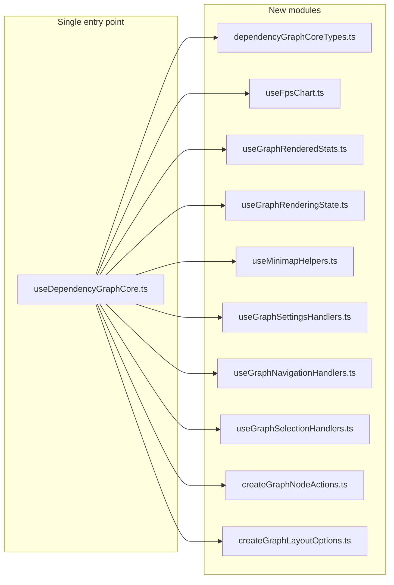

# Split useDependencyGraphCore into targeted modules

## Current state

[useDependencyGraphCore.ts](src/client/composables/useDependencyGraphCore.ts) is a single ~1003-line file that:

- Defines types: `DependencyGraphCoreEnv`, `UseDependencyGraphCoreOptions`, `DependencyGraphCoreReturn`,
  `GraphStatCountEntry`
- Wires 8+ sub-composables (viewport, edge virtualization, search, layout, collision, selection, isolation, FPS, etc.)
- Hosts a large inline options object for `useGraphLayout` (~90 lines)
- Implements FPS chart computeds, rendered stats, rendering/display computeds, minimap helpers, and 20+ event/settings
  handlers inline
- Returns one large object consumed by [DependencyGraph.vue](src/client/components/DependencyGraph.vue)

Only `DependencyGraph.vue` imports from this file; it uses `useDependencyGraphCore` and `DEFAULT_VIEWPORT`. All four
exported type interfaces (`DependencyGraphCoreReturn`, `DependencyGraphCoreEnv`, `UseDependencyGraphCoreOptions`,
`GraphStatCountEntry`) have zero external consumers by name. The refactor keeps the contract: one entry module that
re-exports types and the composable, with implementation moved into focused files.

## Conventions (from codebase analysis)

New modules must follow the established patterns in this codebase:

- **Naming:** `useXxx` for composables that create/return reactive state (Refs, ComputedRefs). `createXxx` for
  non-reactive factories returning plain objects.
- **Options:** Explicit exported `UseXxxOptions` interface. Destructure options as first statement.
- **Return type:** Explicit exported interface using the noun form (e.g., `FpsChart`, `GraphRenderedStats`).
- **DI pattern:** Never import stores directly. Inject via options using one of three tiers:
  - **Flat props** (1-3 deps): `fpsHistory: Ref<number[]>`
  - **Options interface** (4-8 deps): `UseGraphRenderingStateOptions { ... }`
  - **Named subset interfaces** (5+ dependency groups): `SettingsHandlerGraphLayout`, `SettingsHandlerGraphSettings`
    (like `IsolateGraphStore` in `useIsolationMode`)
- **Dispose:** Only include `dispose()` when async resources exist (rAF, timers, listeners). None of the new modules
  hold such resources, so none need `dispose()`. Disposal stays in core.
- **Exports:** All interfaces and types exported. Type-only imports via `import type { ... }`.

## Target layout



## 1. Extract types

**New file:** `src/client/composables/dependencyGraphCoreTypes.ts`

- Move `GraphStatCountEntry`, `DependencyGraphCoreEnv`, `UseDependencyGraphCoreOptions`, `DependencyGraphCoreReturn`
  here.
- Keep `DEFAULT_VIEWPORT` re-export in `useDependencyGraphCore.ts` (it comes from `useGraphViewport` and
  `DependencyGraph.vue` imports it from core).
- Drop the `export type { LayoutConfig }` line from core -- no consumer imports `LayoutConfig` through this file; all
  import directly from `src/client/layout/config.ts`.

**In `useDependencyGraphCore.ts`:** Import types from this file and re-export them so the public surface is unchanged:

```typescript
export type {
  GraphStatCountEntry,
  DependencyGraphCoreEnv,
  UseDependencyGraphCoreOptions,
  DependencyGraphCoreReturn,
} from './dependencyGraphCoreTypes';
```

## 2. FPS chart composable

**New file:** `src/client/composables/useFpsChart.ts` **DI pattern:** Flat props (2 inputs).

- Input: `fpsHistory: Ref<number[]>`, optional chart dimensions (default 220x56).
- Output interface `FpsChart`: `fpsChartScaleMax`, `fpsChartPoints`, `fpsTargetLineY`, `FPS_CHART_WIDTH`,
  `FPS_CHART_HEIGHT`.
- Extracts the 3 computeds from core lines ~224-257.
- Core calls `useFpsCounter(showFps)` then `useFpsChart(fpsHistory)` and passes through the returned values.

## 3. Rendered stats composable

**New file:** `src/client/composables/useGraphRenderedStats.ts` **DI pattern:** Flat props (2 inputs).

- Input: `visualNodes: Ref<DependencyNode[]>`, `visualEdges: Ref<GraphEdge[]>`.
- Output interface `GraphRenderedStats`: `renderedNodeCount`, `renderedEdgeCount`, `renderedNodeTypeCounts`,
  `renderedEdgeTypeCounts`.
- `toSortedTypeCounts` stays internal to this module (generic Map-to-sorted-array utility; consider moving to
  `src/client/utils/` later).
- Type `GraphStatCountEntry` imported from `dependencyGraphCoreTypes`.
- Pure derivation from visual nodes/edges; no store or layout dependency.

## 4. Rendering / display state composable

**New file:** `src/client/composables/useGraphRenderingState.ts` **DI pattern:** Explicit
`UseGraphRenderingStateOptions` interface with flat props (12 inputs).

- Input: env thresholds (subset of `DependencyGraphCoreEnv`), `nodes`, `edges`, `viewportState`, `isLayoutMeasuring`,
  `visualEdges`, `highlightedEdgeIds`, `edgeVirtualizationEnabled`, `isFirefox`, `canvasRendererAvailable`,
  `renderingStrategyId`.
  - **Critical:** `nodes` is required for the `NODE_VISIBLE_RENDER_THRESHOLD` check in `useOnlyRenderVisibleElements`.
- Output interface `GraphRenderingState`: `defaultEdgeOptions`, `renderedEdges`, `useOnlyRenderVisibleElements`,
  `isHeavyEdgeMode`, `minimapAutoHidden`, `showMiniMap`, `isCanvasModeRequested`, `isHybridCanvasMode`,
  `activeRenderingStrategy`.
- Reuses `getRenderingStrategy` from `src/client/rendering/strategyRegistry.ts` (already imported today).
- Reuses `EDGE_MARKER_WIDTH_PX`, `EDGE_MARKER_HEIGHT_PX` from `src/client/layout/edgeGeometryPolicy.ts`.

## 5. Minimap helpers composable

**New file:** `src/client/composables/useMinimapHelpers.ts` **DI pattern:** Flat props (1 input).

- Input: `selectedNode: Ref<DependencyNode | null>`.
- Output interface `MinimapHelpers`: `minimapNodeColor(node)`, `minimapNodeStrokeColor(node)`.
- `handleMinimapNodeClick` moves to the navigation handlers module (it is a one-liner calling `handleFocusNode`).
- Minimap colors are intentionally different from `graphTheme.ts` node backgrounds (different alpha values and base
  colors for class/interface). No reuse from theme.

## 6. Settings handlers composable

**New file:** `src/client/composables/useGraphSettingsHandlers.ts` **DI pattern:** Named subset interfaces (3 dependency
groups + 3 callbacks).

Named interfaces:

- `SettingsHandlerGraphLayout`: `{ requestGraphInitialization, setLayoutConfig, resetLayoutConfig }`
- `SettingsHandlerGraphSettings`: The settings methods needed (setEnabledRelationshipTypes, setEnabledNodeTypes,
  setCollapseScc, setClusterByFolder, setHideTestFiles, setMemberNodeMode, setHighlightOrphanGlobal,
  setDegreeWeightedLayers, setShowFps, setShowFpsAdvanced, setRenderingStrategyId, setRenderingStrategyOption, plus
  getters for collapseScc, clusterByFolder, renderingStrategyId)
- Plus flat callbacks: `syncViewportState`, `requestViewportRecalc`, `setSelectedNode`, `setCameraMode` (from
  interaction -- needed by `handleResetView`)

Output interface `GraphSettingsHandlers`: all 15 `handleXxx` functions.

## 7. Navigation handlers composable

**New file:** `src/client/composables/useGraphNavigationHandlers.ts` **DI pattern:** Named subset interfaces.

Handles: `handleFocusNode`, `handleMinimapNodeClick`, `handleCanvasUnavailable`, `onMoveEnd`.

Dependencies (~10):

- `NavigationHandlerViewport`: `{ onMoveEnd: () => void }`
- `NavigationHandlerEdgeVirtualization`: `{ requestViewportRecalc: (force?: boolean) => void }`
- `NavigationHandlerGraphStore`: `{ semanticSnapshot: GraphSnapshot | null }`
- Plus flat props: `nodes`, `fitView`, `setSelectedNode`, `syncViewportState`, `interaction.setCameraMode`,
  `canvasRendererAvailable`, `graphSettings.renderingStrategyId`, `graphSettings.setRenderingStrategyId`,
  `graphLayout.requestGraphInitialization`.

## 8. Selection handlers composable

**New file:** `src/client/composables/useGraphSelectionHandlers.ts` **DI pattern:** Named subset interfaces.

Handles: `onNodeClick`, `onPaneClick`, `handleKeyDown`, `onNodeMouseEnter`, `onNodeMouseLeave`.

Dependencies (~12):

- `SelectionHandlerState`: `{ selectedNode, hoveredNodeId, contextMenu }`
- `SelectionHandlerActions`:
  `{ setSelectedNode, clearHoverState, applyHoverEdgeHighlight, restoreHoverZIndex, elevateNodeAndChildren }`
- Plus flat props: `nodes`, `edges`, `fitView`, `syncViewportState`, `edgeVirtualization.requestViewportRecalc`,
  `graphSettings` (showFps toggle via setShowFps/showFps getter).

## 9. Node and folder actions factory

**New file:** `src/client/composables/createGraphNodeActions.ts` **DI pattern:** Flat props (non-reactive `createXxx`
factory).

- Export `createGraphNodeActions(options)` where options: `handleFocusNode`, `isolateNeighborhood`, `contextMenu` (Ref),
  `toggleFolderCollapsed` (from graphSettings), `requestGraphInitialization` (from graphLayout).
- Returns `{ nodeActions: NodeActions, folderCollapseActions: FolderCollapseActions }`.
- Types `NodeActions` and `FolderCollapseActions` imported from `src/client/components/nodes/utils.ts` (already defined
  there).

## 10. Layout options factory

**New file:** `src/client/composables/createGraphLayoutOptions.ts` **DI pattern:** Flat props (non-reactive `createXxx`
factory).

- Export `createGraphLayoutOptions(params)` that takes graphStore, graphSettings, interaction, fitView,
  updateNodeInternals, edgeVirtualization suspend/resume, syncViewportState, nodeDimensionTracker,
  resetSearchHighlightState, isFirefox, graphRootRef, and propsData.
- Returns the exact options object matching `UseGraphLayoutOptions` (the type exported from `useGraphLayout.ts`).
- Core becomes: `const graphLayout = useGraphLayout(createGraphLayoutOptions({ ... }));`
- Reduces core by ~90 lines.

## 11. Orchestrator: useDependencyGraphCore.ts

- Shrinks to ~250-350 lines.
- Imports types from `dependencyGraphCoreTypes`, sub-composables, and factories.
- Wires the existing sub-composables in order: stores, vue-flow, viewport, edgeVirtualization, searchHighlighting,
  nodeHoverZIndex, graphLayout (via factory), collisionResolution, selectionHighlighting, isolationMode.
- Calls new composables: useFpsChart, useGraphRenderedStats, useGraphRenderingState, useMinimapHelpers,
  useGraphSettingsHandlers, useGraphNavigationHandlers, useGraphSelectionHandlers, createGraphNodeActions.
- Keeps `reconcileSelectedNodeFn` wiring between collision and selection (cross-composable circular dep).
- Keeps Firefox `<html>` attribute side effect.
- Keeps `dispose()` calling dispose on viewport, edgeVirtualization, selectionHighlighting, collisionResolution,
  graphLayout, isolationMode, and clearHoverState. No new modules need dispose.
- Re-exports `DEFAULT_VIEWPORT` from `useGraphViewport` and type re-exports from `dependencyGraphCoreTypes`.
- No barrel file. DependencyGraph.vue keeps `from '../composables/useDependencyGraphCore'`.

## Implementation order

1. Create `dependencyGraphCoreTypes.ts` -- move types, update core to import and re-export.
2. Create `useFpsChart.ts`, `useGraphRenderedStats.ts`, `useGraphRenderingState.ts`, `useMinimapHelpers.ts` -- switch
   core to use them (pure computeds, lowest coupling).
3. Create `createGraphLayoutOptions.ts` -- refactor core to use it for `useGraphLayout`.
4. Create `useGraphSettingsHandlers.ts` -- wire options and replace inline settings handlers in core.
5. Create `useGraphNavigationHandlers.ts` and `useGraphSelectionHandlers.ts` -- wire context and replace inline event
   handlers in core.
6. Create `createGraphNodeActions.ts` -- replace inline nodeActions/folderCollapseActions in core.
7. Clean up core: remove dead code, verify the return object, run type-check.
8. Run existing tests and manual smoke test (viewport, minimap, FPS panel, layout/settings changes, selection,
   isolation, search, keyboard/hover).

## Files to create (all in `src/client/composables/`)

- `dependencyGraphCoreTypes.ts` -- All core type interfaces
- `useFpsChart.ts` -- FPS chart dimensions and computeds from fpsHistory
- `useGraphRenderedStats.ts` -- Rendered node/edge counts and type-grouped counts
- `useGraphRenderingState.ts` -- defaultEdgeOptions, renderedEdges, visibility/heavy/minimap/canvas computeds
- `useMinimapHelpers.ts` -- minimapNodeColor, minimapNodeStrokeColor
- `useGraphSettingsHandlers.ts` -- All handleXxx that change settings and trigger layout re-init
- `useGraphNavigationHandlers.ts` -- Focus, minimap click, move end, canvas fallback
- `useGraphSelectionHandlers.ts` -- Node click, pane click, keyboard, hover enter/leave
- `createGraphNodeActions.ts` -- nodeActions + folderCollapseActions factory
- `createGraphLayoutOptions.ts` -- Build useGraphLayout options adapter object

## What stays in core

- Composition order of sub-composables (viewport, edge virtualization, search, layout, collision, selection, isolation).
- Wiring of `reconcileSelectedNodeFn` between collision and selection.
- Firefox `<html>` attribute side effect.
- `dispose()` -- only core holds async resources via sub-composables; no new module needs its own dispose.
- The final `return { ... }` object that satisfies `DependencyGraphCoreReturn`.

## Risk and testing

- **Contract:** `DependencyGraphCoreReturn` and `DEFAULT_VIEWPORT` are the only externally consumed exports. Both are
  preserved. `DependencyGraph.vue` requires zero changes.
- **No barrel:** No `index.ts`. Direct imports from `useDependencyGraphCore.ts` only.
- **No tests exist** for the core composable today. The extraction makes individual modules testable; consider adding
  unit tests for `useFpsChart` and `useGraphRenderedStats` as follow-up (pure computed derivations, easy to test without
  DOM).
- **Smoke test:** viewport, minimap, FPS panel, layout/settings changes, selection, isolation, search, keyboard/hover
  behavior.
