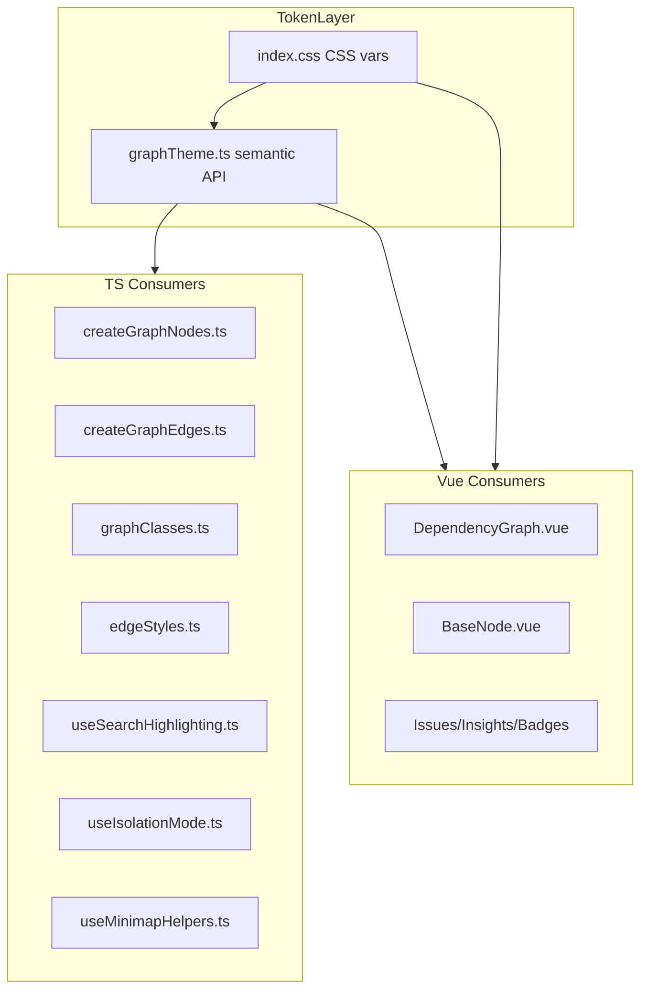

---

name: Unify graphTheme usage overview: Replace theme drift with an explicit token architecture: CSS custom properties
hold runtime visual values, graphTheme.ts becomes the typed semantic adapter used by app code, style-mutating helpers
are migrated to the same contract, and layout changes are split from low-risk token cleanup. todos:

- id: freeze-current-contract content: Capture current effective node, edge, severity, minimap, and layout values before
  refactoring status: pending
- id: define-theme-boundaries content: Decide and document token ownership between index.css, graphTheme.ts, and non-DOM
  consumers status: pending
- id: normalize-graphtheme-model content: Make graphTheme.ts exhaustive and capable of describing actual per-kind node
  and edge appearance status: pending
- id: migrate-style-mutators content: Update graphClasses.ts, edgeStyles.ts, search highlighting, isolation mode, and
  related helpers to use the same theme contract status: pending
- id: migrate-direct-consumers content: Replace hardcoded literals in theme-managed Vue components and CSS with semantic
  tokens status: pending
- id: dedupe-geometry-constants content: Share marker and handle geometry constants from edgeGeometryPolicy.ts and
  remove duplicates status: pending
- id: add-enforcement content: Add tests or lint-style guards to prevent raw theme literals from reappearing in target
  client files status: pending
- id: verify-and-stage content: Add explicit verification steps and keep layout spacing migration as a separate staged
  decision status: pending isProject: false

---

# Unify graphTheme Usage Safely

## Review Findings

The original plan was directionally right, but it had four structural problems:

1. It claimed a **single source of truth** while still maintaining tokens in both
   [src/client/theme/graphTheme.ts](src/client/theme/graphTheme.ts) and [src/index.css](src/index.css). Without code
   generation or enforcement, that is still dual maintenance.
2. It mixed **low-risk token cleanup** with **high-risk behavior changes**, especially layout spacing and stroke-width
   normalization.
3. It missed several **style-mutating TypeScript helpers** that sit between theme data and rendered output, especially
   [src/client/theme/graphClasses.ts](src/client/theme/graphClasses.ts),
   [src/client/theme/edgeStyles.ts](src/client/theme/edgeStyles.ts),
   [src/client/composables/useSearchHighlighting.ts](src/client/composables/useSearchHighlighting.ts), and
   [src/client/composables/useIsolationMode.ts](src/client/composables/useIsolationMode.ts).
4. It lacked an **anti-drift mechanism**. Centralization alone will not hold if future PRs can reintroduce raw
   `rgba(...)`, `#hex`, or duplicate widths unchecked.

## Target Architecture

The safer, more honest target is **one token registry with explicit consumer layers**, not a hand-wavy single source
claim.

- **Runtime visual values for DOM/SVG** live in [src/index.css](src/index.css) as CSS custom properties.
- **Typed semantic access for app code** lives in [src/client/theme/graphTheme.ts](src/client/theme/graphTheme.ts).
- **Geometry and layout-only constants** stay in dedicated layout modules unless we intentionally decide to make them
  theme-owned.
- **Non-DOM consumers** like minimap helpers and style-mutating composables must consume the same semantic token
  contract, not ad hoc literals.

This is the conventional, stable approach for Vue + Vite. A stricter TS-to-CSS codegen pipeline is possible later, but
that adds complexity and is not required for this refactor.

## Phase 0: Freeze the Current Contract

Before changing anything, capture the current on-screen contract so we know what is parity work and what is intentional
normalization.

### Files To Audit

- [src/client/theme/graphTheme.ts](src/client/theme/graphTheme.ts)
- [src/index.css](src/index.css)
- [src/client/components/DependencyGraph.vue](src/client/components/DependencyGraph.vue)
- [src/client/components/nodes/BaseNode.vue](src/client/components/nodes/BaseNode.vue)
- [src/client/composables/useMinimapHelpers.ts](src/client/composables/useMinimapHelpers.ts)
- [src/client/layout/simpleHierarchicalLayout.ts](src/client/layout/simpleHierarchicalLayout.ts)

### Baseline Decisions

- Pick the current authoritative severity palette instead of silently merging two different reds/blues.
- Decide whether current edge widths are `1/2`, `1.5/2.5`, or edge-kind-specific.
- Record current root layout gaps (`40` / `60`) so layout migration does not accidentally restyle graph behavior.

## Phase 1: Normalize graphTheme.ts Into a Real Semantic API

**File:** [src/client/theme/graphTheme.ts](src/client/theme/graphTheme.ts)

Make the theme model describe what the app actually renders today.

- Expand the node model so per-kind appearance is typed instead of living only in `getNodeStyle()` literals.
- Expand the edge model so every `DependencyEdgeKind` is handled intentionally.
- Make `getNodeStyle()` and `getEdgeStyle()` exhaustive over their unions.
- Resolve the inconsistency between `getEdgeStyle()` and `getEdgeColor()`: either remove `getEdgeColor()` or make it
  exhaustive and backed by the same source.
- Explicitly define what `extends`, `uses`, and `contains` should look like. Today they partially fall through.

### Important Constraint

Do not bloat `graphTheme.ts` into a grab bag of unrelated constants. If the file gets unwieldy, split semantic token
tables into a small sibling module such as `graphTokens.ts`, while keeping
[src/client/theme/graphTheme.ts](src/client/theme/graphTheme.ts) as the public API imported by the rest of the app.

## Phase 2: Align CSS Variables With the Same Semantic Contract

**File:** [src/index.css](src/index.css)

Add or rename CSS variables so the DOM-facing surface matches the semantic theme model.

Include variables for:

- Edge-kind colors
- Node-kind background and border accents
- Severity colors
- Handle and marker size
- Edge widths and label font size

### Key Rule

Set these variables to the **current effective values first**. This phase is mechanical centralization, not redesign.

Where practical, have [src/client/theme/graphTheme.ts](src/client/theme/graphTheme.ts) return `var(--token)` strings for
DOM/SVG style properties rather than duplicating raw hex values in TypeScript.

## Phase 3: Migrate the Style-Mutating TypeScript Layer

These files are part of the real blast radius and must be migrated with the theme contract:

- [src/client/theme/graphClasses.ts](src/client/theme/graphClasses.ts)
- [src/client/theme/edgeStyles.ts](src/client/theme/edgeStyles.ts)
- [src/client/composables/useSearchHighlighting.ts](src/client/composables/useSearchHighlighting.ts)
- [src/client/composables/useIsolationMode.ts](src/client/composables/useIsolationMode.ts)
- [src/client/composables/useMinimapHelpers.ts](src/client/composables/useMinimapHelpers.ts)
- [src/client/composables/useGraphRenderingState.ts](src/client/composables/useGraphRenderingState.ts)
- [src/client/graph/drilldown/buildSymbolDrilldown.ts](src/client/graph/drilldown/buildSymbolDrilldown.ts)
- [src/client/graph/drilldown/symbolHelpers.ts](src/client/graph/drilldown/symbolHelpers.ts)

### What Changes Here

- Replace hover and selection fallbacks like `#404040` with the semantic theme contract.
- Ensure `mergeNodeInteractionStyle()` re-bases from the new typed node appearance without losing sizing behavior.
- Ensure search highlighting and isolation mode rebuild edge and node styles from the same token source, not from
  literals.
- Update minimap color helpers to use the same semantic palette as main graph nodes.

## Phase 4: Migrate Direct CSS and Vue Consumers

Replace hardcoded literals in theme-managed components with semantic variables and helpers.

### Primary Files

- [src/client/components/DependencyGraph.vue](src/client/components/DependencyGraph.vue)
- [src/client/components/GraphControls.vue](src/client/components/GraphControls.vue)
- [src/client/components/IssuesPanel.vue](src/client/components/IssuesPanel.vue)
- [src/client/components/InsightsDashboard.vue](src/client/components/InsightsDashboard.vue)
- [src/client/components/NodeContextMenu.vue](src/client/components/NodeContextMenu.vue)
- [src/client/components/nodes/BaseNode.vue](src/client/components/nodes/BaseNode.vue)
- [src/client/components/nodes/GroupNode.vue](src/client/components/nodes/GroupNode.vue)
- [src/client/components/nodes/InsightBadgeStrip.vue](src/client/components/nodes/InsightBadgeStrip.vue)

### Migration Rules

- Use CSS variables for direct DOM styling.
- Remove raw hex fallbacks where the global variable already exists.
- Keep direct per-component styling only where the value is truly local UI chrome, not a graph-wide token.

## Phase 5: Deduplicate Geometry Constants

Keep this scoped to values that are clearly shared already.

### Files

- [src/client/layout/edgeGeometryPolicy.ts](src/client/layout/edgeGeometryPolicy.ts)
- [src/client/composables/useGraphRenderingState.ts](src/client/composables/useGraphRenderingState.ts)
- [src/index.css](src/index.css)
- [src/client/components/nodes/GroupNode.vue](src/client/components/nodes/GroupNode.vue)

### What To Do

- Reuse exported marker/handle geometry from
  [src/client/layout/edgeGeometryPolicy.ts](src/client/layout/edgeGeometryPolicy.ts) instead of redeclaring `12px`/`12`.
- Unify marker and handle sizing only where the same value is already intended.

### What Not To Force In This Pass

- [src/client/graph/transforms/edgeHighways.ts](src/client/graph/transforms/edgeHighways.ts)
- [src/client/components/DebugBoundsOverlay.vue](src/client/components/DebugBoundsOverlay.vue)

Those widths are context-specific enough that they should be treated as a follow-up decision, not bundled into visual
token cleanup by default.

## Phase 6: Layout Spacing Is a Separate Decision

Do **not** wire [src/client/theme/graphTheme.ts](src/client/theme/graphTheme.ts) layout spacing into
[src/client/layout/simpleHierarchicalLayout.ts](src/client/layout/simpleHierarchicalLayout.ts) as part of the initial
token migration unless we intentionally want layout behavior to change.

Two safe options:

1. **Safer, conventional path:** remove or relocate unused `layout.spacing` from `graphTheme.ts` for now, and keep
   layout constants owned by the layout subsystem.
2. **Intentional follow-up path:** first set theme layout spacing to the current layout constants, then migrate
   [src/client/layout/simpleHierarchicalLayout.ts](src/client/layout/simpleHierarchicalLayout.ts) in a separate PR with
   layout-specific regression validation.

## Verification and Enforcement

Add explicit checks so the refactor stays correct after merge.

### Required Verification

- Typecheck
- Lint
- Build
- Targeted unit tests for theme helper exhaustiveness and expected output
- Browser smoke validation for:
  - overview graph
  - node selection and hover
  - search highlighting
  - isolation mode
  - minimap
  - issues and insights severity rendering

### Anti-Drift Guard

Use one of these low-overhead enforcement options:

- A focused test or CI script that fails on raw `#hex` / `rgba(...)` in allowlisted client theme files
- A lint-style rule for theme-managed folders

The repo-local test/script is the simpler, more conventional first step.

## Scope

- This refactor is primarily about **theme usage and token drift**, not visual redesign.
- Mechanical centralization should preserve current values.
- Any intentional normalization of severity colors, stroke widths, or layout spacing must be called out as a behavior
  change in the implementation PR.
- Tailwind utility classes can remain for local layout and spacing, but graph-wide semantic colors and widths should not
  be reintroduced as raw literals in theme-managed files.
