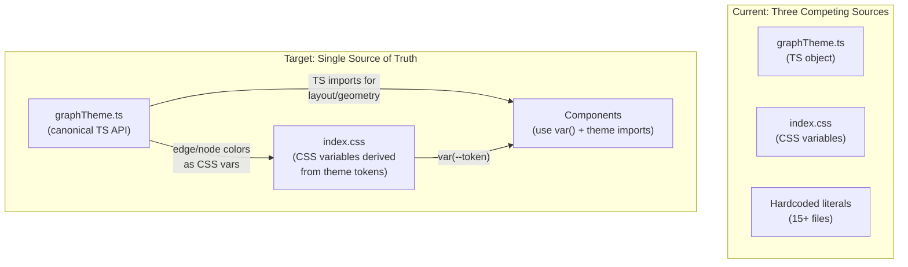

# Unify graphTheme Across the Application

## Problem

The codebase has **three competing sources of truth** for graph visual tokens:

1. `**graphTheme.ts` -- TypeScript object with node/edge colors, widths, layout spacing
2. `**src/index.css` -- CSS custom properties with overlapping (sometimes conflicting) values
3. **Hardcoded literals** -- `rgba(...)`, `#hex`, and `px` values scattered across ~15 Vue components and ~8 TypeScript
   files

This causes:

- `graphTheme.layout.spacing` is **completely unused** -- layout constants in `simpleHierarchicalLayout.ts` are
  independent
- `getEdgeColor()` is **exported but never called**
- CSS edge stroke widths (`1.5px`/`2.5px` in `index.css`) diverge from TS theme (`1`/`2` in `graphTheme.ts`)
- Node-kind colors in `getNodeStyle()` use inline `rgba()` literals that don't match `graphTheme.nodes.colors`
- Marker/handle size `12px` is duplicated across `edgeGeometryPolicy.ts`, `useGraphRenderingState.ts`, `index.css`, and
  `GroupNode.vue`
- Minimap colors in `useMinimapHelpers.ts` duplicate node-kind palette without referencing theme
- Severity colors (`#f87171`, `#fbbf24`, `#60a5fa`) are copy-pasted across `BaseNode.vue`, `InsightBadgeStrip.vue`,
  `IssuesPanel.vue`, `InsightsDashboard.vue`, and `DependencyGraph.vue`

## Phase 1: Expand the CSS Variable Token System

**Goal:** Make `index.css` CSS custom properties cover ALL visual tokens the app needs.

**File:** [src/index.css](src/index.css)

Add missing tokens to the `@theme` block:

- **Edge colors** -- `--color-edge-import`, `--color-edge-export`, `--color-edge-inheritance`,
  `--color-edge-implements`, `--color-edge-dependency`, `--color-edge-devDependency`, `--color-edge-peerDependency`,
  `--color-edge-contains`, `--color-edge-default` (values from `graphTheme.edges.colors`)
- **Node-kind accent colors** (the `rgba` backgrounds/borders used per node type) -- `--color-node-package-bg`,
  `--color-node-module-bg`, `--color-node-class-bg`, `--color-node-interface-bg`, `--color-node-group-bg`, etc. and
  corresponding `--color-node-*-border`
- **Severity colors** -- `--color-severity-error`, `--color-severity-warning`, `--color-severity-info` (consolidate the
  3 repeated hex sets: `#f87171`/`#fbbf24`/`#93c5fd` and `#ef4444`/`#fbbf24`/`#60a5fa`)
- **Geometry tokens** -- `--graph-handle-size: 12px`, `--graph-edge-width: 1px`, `--graph-edge-width-selected: 2px`,
  `--graph-edge-width-inheritance: 2px`, `--graph-edge-label-font-size: 12px`

## Phase 2: Refactor graphTheme.ts to Be the Single TS API

**File:** [src/client/theme/graphTheme.ts](src/client/theme/graphTheme.ts)

- Keep the `GraphTheme` type system and `graphTheme` const as the canonical TS-side configuration
- Update `getNodeStyle()` to build backgrounds/borders from the theme's node-kind colors (which align with CSS
  variables) instead of inline `rgba()` literals
- Align edge stroke widths: theme says `default: 1`, CSS says `1.5px` -- pick one and make both agree
- Remove `getEdgeColor()` (unused) or replace the 0 call sites' manual color lookups with it
- Export a `GRAPH_HANDLE_SIZE_PX` constant for geometry shared between TS and CSS

## Phase 3: Wire Layout Spacing to the Layout Engine

**Files:**

- [src/client/layout/simpleHierarchicalLayout.ts](src/client/layout/simpleHierarchicalLayout.ts) -- replace
  `ROOT_H_GAP=40`, `ROOT_V_GAP=60` with `graphTheme.layout.spacing.horizontal` / `vertical` (or decide these are
  intentionally independent and **remove** `layout.spacing` from the theme to avoid the dead-code confusion)
- [src/client/layout/edgeGeometryPolicy.ts](src/client/layout/edgeGeometryPolicy.ts) -- export `EDGE_ARROW_SIZE_PX` and
  share it (already exported; just fix the duplicate in `useGraphRenderingState.ts`)

## Phase 4: Replace Hardcoded Literals in Components

Replace scattered hex/rgba with CSS variable references. Files and what changes:

- **[src/client/components/nodes/BaseNode.vue](src/client/components/nodes/BaseNode.vue)** -- severity colors
  `#ef4444`/`#fbbf24`/`#60a5fa` to `var(--color-severity-*)`
- **[src/client/components/nodes/InsightBadgeStrip.vue](src/client/components/nodes/InsightBadgeStrip.vue)** --
  `#f87171`/`#fbbf24`/`#93c5fd` to `var(--color-severity-*)`
- **[src/client/components/IssuesPanel.vue](src/client/components/IssuesPanel.vue)** -- same severity palette
- **[src/client/components/InsightsDashboard.vue](src/client/components/InsightsDashboard.vue)** -- severity palette +
  panel bg/border fallbacks to proper `var()` without raw hex fallbacks
- **[src/client/components/DependencyGraph.vue](src/client/components/DependencyGraph.vue)** -- `#22d3ee`, `#facc15`,
  status colors to CSS variables; edge hover stroke `#404040` to `var(--color-edge-default)`
- **[src/client/composables/useMinimapHelpers.ts](src/client/composables/useMinimapHelpers.ts)** -- derive node-kind
  colors from the same palette tokens as `getNodeStyle` (either import from `graphTheme` or use a shared node-color
  lookup)
- **[src/client/components/nodes/GroupNode.vue](src/client/components/nodes/GroupNode.vue)** --
  `--folder-inner-handle-inset: 12px` to `var(--graph-handle-size)`
- **[src/index.css](src/index.css)** -- `.vue-flow__edge-path` stroke-width `1.5px` to `var(--graph-edge-width)`,
  selected/hover `2.5px` to `var(--graph-edge-width-selected)`, handle `12px` to `var(--graph-handle-size)`

## Phase 5: Deduplicate Geometry Constants

- **[src/client/composables/useGraphRenderingState.ts](src/client/composables/useGraphRenderingState.ts)** -- remove
  duplicate `EDGE_MARKER_WIDTH_PX`/`EDGE_MARKER_HEIGHT_PX` constants; import from `edgeGeometryPolicy.ts`
- **[src/client/graph/transforms/edgeHighways.ts](src/client/graph/transforms/edgeHighways.ts)** --
  `HIGHWAY_DEFAULT_NODE_WIDTH=260` and `DebugBoundsOverlay.vue`'s `DEFAULT_NODE_WIDTH=240` -- decide if these should
  share a theme constant or remain context-specific

## Scope / Non-Goals

- Not changing the visual appearance -- all color values stay the same, just centralized
- Not introducing a runtime theme-switching feature (future work)
- Debug-only constants (FPS chart dimensions, test fixtures) remain local
- Tailwind utility classes are fine as-is; only raw CSS/inline-style literals get tokenized
