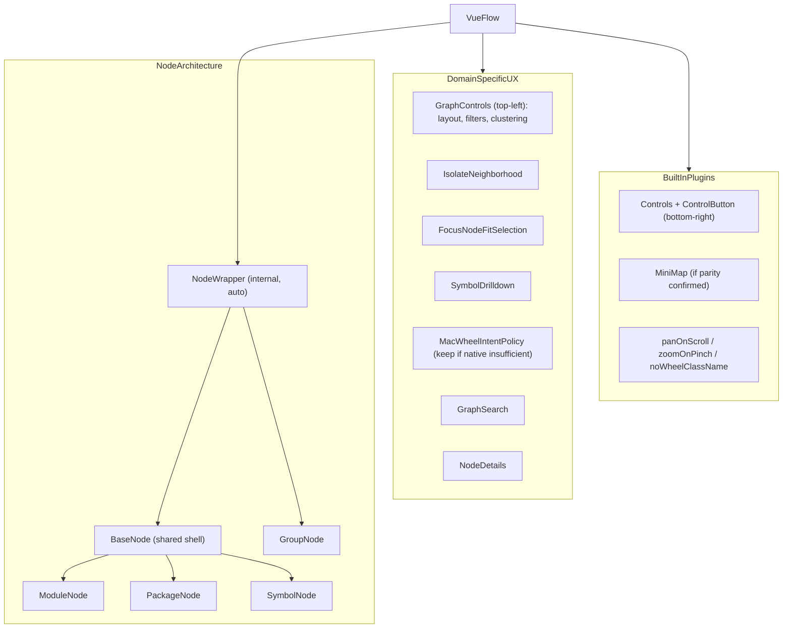

# Vue Flow Dedup + NodeWrapper Alignment Plan

## What We Verified

- Custom implementations exist for controls, minimap, and interaction handling:
  - [index.vue](src/client/components/DependencyGraph/index.vue) -- graph root, wheel handling, keyboard nav,
    focus/isolate logic
  - [GraphControls.vue](src/client/components/DependencyGraph/components/GraphControls.vue) -- zoom, fit, layout,
    filters, clustering, analysis toggles
  - [GraphMiniMap.vue](src/client/components/DependencyGraph/components/GraphMiniMap.vue) -- custom SVG minimap (358
    lines) with type colors, selected highlight, viewport drag, click-to-center
- `@vue-flow/controls@1.1.3` is installed but never imported or rendered anywhere. Dormant CSS targeting
  `.vue-flow__controls` exists in [src/index.css](src/index.css) lines 171-193.
- `@vue-flow/minimap` and `@vue-flow/node-toolbar` are **not installed**.
- `NodeWrapper` is an **internal** Vue Flow component. The `.d.ts` file exists at
  `node_modules/@vue-flow/core/dist/components/Nodes/NodeWrapper.d.ts` but is **not** in the package's `exports` map. It
  cannot be imported via normal module resolution and should never be subclassed.
- Custom nodes (BaseNode, ModuleNode, PackageNode, SymbolNode) are rendered **inside** NodeWrapper automatically via
  VueFlow's `node-types` slot mechanism. This is the correct architecture. No inheritance issue exists.
- `GroupNode` bypasses `BaseNode` entirely -- no handles, no action buttons, no `nodrag`/`nowheel` classes.

## NodeWrapper Responsibility Split (Critical Context)

NodeWrapper (internal, per-node) handles:

- Outer `div.vue-flow__node` with `transform: translate(x,y)`, z-index, pointer events
- Selection state (`.selected` class), drag state (`.dragging` class, `cursor: grab/grabbing`)
- d3-drag integration with `noDragClassName` filter (default: `"nodrag"`)
- Scroll exclusion via `noWheelClassName` (default: `"nowheel"`)
- ARIA: `role="group"`, `aria-roledescription="node"`, `tabIndex`, `aria-describedby`, keyboard handler
- ResizeObserver for dimension tracking
- Passes full `NodeProps` to child: `id`, `type`, `data`, `selected`, `dragging`, `resizing`, `connectable`, `position`,
  `dimensions`, `zIndex`, `sourcePosition`, `targetPosition`, `dragHandle`, `label`, `events`, `parentNodeId`

Custom nodes (BaseNode etc.) handle:

- Inner content: header, body slots, subnodes, handles
- Domain-specific styling and layout

## Known Bugs (Pre-existing)

1. **Action buttons trigger drag**: `.base-node-action-button` elements in `BaseNode.vue` lack `nodrag` class. d3-drag's
   filter checks `hasSelector(target, '.nodrag', nodeEl)` -- without the class, mousedown on buttons initiates a drag.
2. **Collapsible toggles trigger drag**: `.module-section-toggle` in `ModuleNode.vue` and toggle buttons in
   `SymbolNode.vue` also lack `nodrag`.
3. **No `nowheel` on scrollable node content**: Scrollable regions inside nodes can trigger canvas zoom/pan.
4. `**cursor: move` vs `cursor: grab` inconsistency: BaseNode sets `cursor: move` on `.base-node-container` (line 199)
   while NodeWrapper uses `cursor: grab`/`grabbing`.
5. **Duplicated selection styling**: Both NodeWrapper (`.selected` on outer div) and BaseNode (`.base-node-selected` on
   inner div) apply selection visuals. Not a functional bug, but confusing.
6. `**DependencyProps` too narrow: Omits `dragging`, `resizing`, `connectable`, `position`, `dimensions`,
   `parentNodeId`, `dragHandle`, `events` from Vue Flow's full `NodeProps`. Limits future feature use.
7. `**baseNodeProps` computed duplicated in 3 files: ModuleNode, PackageNode, SymbolNode all manually rebuild the same
   prop-forwarding object.
8. **Global `CustomEvent` bus**: BaseNode dispatches
   `window.dispatchEvent(new CustomEvent('dependency-graph-node-action'))` instead of using Vue emit/provide-inject.
   Global listener in `index.vue` receives it.

## Architecture Target

## Migration Strategy (Execution Order)

### Phase 1: Baseline behavior lock (test artifacts)

**Deliverable:** Playwright e2e test suite that passes against the current UI.

Test cases to cover:

- Mouse wheel zoom on non-Mac (deltaMode and deltaY behavior)
- Mac trackpad: two-finger scroll pans, pinch zooms centered on cursor
- Overlay scroll: `NodeDetails` panel scrolls without affecting canvas
- Keyboard: Arrow keys navigate connected nodes, fitView follows
- Minimap: click-to-center, click-on-node centering, viewport rect drag
- Controls: zoom in/out/fit buttons work
- Focus action: clicking focus button on node centers camera
- Isolate action: clicking isolate button filters to neighborhood
- Back to overview: button restores full graph

**Files to create:**

- `tests/e2e/graph-interaction.spec.ts`

**Rollback anchor:** This suite becomes the regression gate for every subsequent phase. If any phase breaks these tests,
revert that phase's changes.

### Phase 2: NodeWrapper alignment + interaction safety hardening

**Goal:** Fix all known interaction bugs before any plugin migration.

**Concrete changes:**

In [BaseNode.vue](src/client/components/DependencyGraph/nodes/BaseNode.vue):

- Add `class="nodrag"` to both `.base-node-action-button` elements (lines 142-159)
- Change `cursor: move` to `cursor: grab` in `.base-node-container` style (line 199)

In [ModuleNode.vue](src/client/components/DependencyGraph/nodes/ModuleNode.vue):

- Add `class="nodrag"` to `.module-section-toggle` buttons
- Add `class="nodrag"` to `.dependency-more-button`
- Add `class="nowheel"` to `.module-section-content` if content is scrollable

In [SymbolNode.vue](src/client/components/DependencyGraph/nodes/SymbolNode.vue):

- Add `class="nodrag"` to any interactive elements inside CollapsibleSection headers

In [GroupNode.vue](src/client/components/DependencyGraph/nodes/GroupNode.vue):

- Add `class="nodrag"` to `.group-node-label` if it becomes interactive in the future (defensive)

**Prop consolidation:**

- Create a shared utility `buildBaseNodeProps(props: DependencyProps, overrides?)` in a new file
  `src/client/components/DependencyGraph/nodes/utils.ts`
- Widen `DependencyProps` in [types.ts](src/client/components/DependencyGraph/types.ts) to include `dragging?: boolean`,
  `connectable?: HandleConnectable`, and `parentNodeId?: string` for forward compatibility
- Replace the 3 duplicated `baseNodeProps` computeds in ModuleNode, PackageNode, SymbolNode with the shared utility

**Acceptance:** Phase 1 tests still pass. Action buttons no longer drag. Scrollable regions no longer zoom canvas.

### Phase 3: Replace global CustomEvent with Vue communication

**Goal:** Eliminate the `window.dispatchEvent` antipattern.

**Approach:** Use Vue `provide`/`inject` to expose a callback from `index.vue` that nodes can call directly.

**Concrete changes:**

In [index.vue](src/client/components/DependencyGraph/index.vue):

- Create an injection key and provide an object:
  `{ focusNode: handleFocusNode, isolateNeighborhood: isolateNeighborhood }`
- Remove `window.addEventListener('dependency-graph-node-action', ...)` from `onMounted`/`onUnmounted`
- Remove `handleNodeActionEvent` function

In [BaseNode.vue](src/client/components/DependencyGraph/nodes/BaseNode.vue):

- `inject` the node-actions object
- Replace `triggerNodeAction('focus')` with `nodeActions.focusNode(props.id)`
- Replace `triggerNodeAction('isolate')` with `nodeActions.isolateNeighborhood(props.id)`
- Remove `triggerNodeAction` function entirely

**Acceptance:** Focus/isolate actions work identically. No global event listeners. Phase 1 tests still pass.

### Phase 4: Integrate Vue Flow Controls for zoom/fit

**Goal:** Use the already-installed `@vue-flow/controls` for zoom in/out, fit view, and lock interactive.

**Concrete changes:**

In [index.vue](src/client/components/DependencyGraph/index.vue):

- Import `Controls` and `ControlButton` from `@vue-flow/controls`
- Import `@vue-flow/controls/dist/style.css`
- Add `<Controls position="bottom-right" :show-interactive="false">` with two `<ControlButton>` children for "Reset
  View" and "Reset Layout"
- The built-in Controls provide zoom in, zoom out, fit view buttons automatically

In [GraphControls.vue](src/client/components/DependencyGraph/components/GraphControls.vue):

- Remove the zoom in/out/fit/reset button group (lines 133-168)
- Keep everything else: layout algorithm, direction, spacing, clustering, node types, member display, analysis,
  relationship types

In [src/index.css](src/index.css):

- Audit lines 171-193 (`.vue-flow__controls` styles). Reconcile with the actual rendered Controls component. Update
  colors/borders to match the dark graph theme, or remove if the component's built-in styles are sufficient.

In [vite.config.ts](vite.config.ts):

- `@vue-flow/controls` is already in `flow-vendor` chunk and `optimizeDeps.include` -- no change needed here

**Panel layout:** Built-in Controls render at `bottom-right`. Custom GraphControls stays at `top-left`. No overlap.

**Acceptance:** Zoom/fit/reset work from the new Controls panel. GraphControls panel is smaller (filters/layout only).
Phase 1 tests still pass. No dormant CSS surprises.

### Phase 5: Evaluate @vue-flow/minimap parity (spike, not migration)

**Goal:** Determine whether the official minimap can replace the custom one **before** committing to the migration.

**Spike checklist (investigate, do not ship):**

1. Install `@vue-flow/minimap` temporarily
2. Test `nodeColor` prop with a function: can it reproduce `nodeFill()` (package=teal, module=blue,
   class/interface=amber)?
3. Test `nodeStrokeColor` prop: can it highlight the selected node with `#22d3ee`?
4. Test `pannable` + `zoomable`: does it match the current viewport-rect drag behavior?
5. Can individual node clicks in the minimap center the viewport? (Custom `GraphMiniMap` has `centerOnNode`)
6. Does the minimap properly render edges?

**Decision gate:**

- If items 1-4 are satisfactory and item 5 can be achieved via the `node-${type}` slot, proceed with migration behind a
  feature flag (env var `VITE_USE_BUILTIN_MINIMAP=true`)
- If item 5 or 6 cannot be replicated, **keep the custom minimap** and document why. Do not force a lateral move.

**If proceeding:**

- Add `@vue-flow/minimap` to `flow-vendor` chunk in [vite.config.ts](vite.config.ts)
- Implement toggle in `index.vue` using `import.meta.env.VITE_USE_BUILTIN_MINIMAP === 'true'`
- Conditionally render `<MiniMap>` or `<GraphMiniMap>`

**Acceptance:** Spike document with pass/fail for each checklist item. If migrating: both minimaps work behind flag,
Phase 1 tests pass with either.

### Phase 6: Evaluate Vue Flow native interaction vs custom wheel handler

**Goal:** Determine if the custom `handleWheel` + `classifyWheelIntent` can be removed.

**Test matrix (must pass on macOS Chrome, Safari, and Firefox):**

- Two-finger trackpad scroll -> Pan canvas (`panOnScroll: true`)
- Pinch-to-zoom (trackpad) -> Zoom centered on cursor (`zoomOnPinch: true`)
- Mouse wheel (vertical) -> Zoom (`zoomOnScroll: true`)
- Scroll inside NodeDetails overlay -> Scroll overlay, not canvas (`noWheelClassName` on overlay)

**Concrete test:**

- Temporarily set `panOnScroll: true`, `zoomOnScroll: true`, `zoomOnPinch: true` and remove the custom `handleWheel`
  listener
- Replace `data-graph-overlay-scrollable` with `class="nowheel"` on the NodeDetails panel
- Run Phase 1 tests on macOS

**Decision gate:**

- If all gestures behave correctly: remove `handleWheel`, `classifyWheelIntent`, `wheelIntent.ts`, and the `isMac`
  conditional props
- If trackpad scroll vs pinch is not properly distinguished by Vue Flow's built-in d3-zoom handler (likely -- Vue Flow
  uses `event.ctrlKey` for pinch which matches browser behavior, but cursor-centered zoom math may differ): **keep the
  custom handler** and document specifically which gesture fails

**Acceptance:** Either the custom handler is removed with passing tests, or a documented decision to keep it with
specific failure evidence.

### Phase 7: Evaluate @vue-flow/node-toolbar for focus/isolate (spike)

**Goal:** Determine if `NodeToolbar` improves the focus/isolate action surface.

**Concerns specific to this codebase:**

- Nodes are dense; a floating toolbar may occlude neighbors
- Current inline buttons (in the node header) are always visible on hover -- toolbar would show only on selection
- Keyboard reachability: toolbar must be tab-reachable when node is focused

**Spike checklist:**

1. Install `@vue-flow/node-toolbar` temporarily
2. Move focus/isolate buttons into `<NodeToolbar :position="Position.Top" :offset="12">` inside BaseNode
3. Test with 50+ node graphs: does the toolbar occlude content?
4. Test keyboard: can you Tab to toolbar buttons after focusing a node?
5. Test screen reader: are toolbar buttons announced?

**Decision gate:**

- If toolbar UX is clearly better or equivalent: adopt and remove inline buttons
- If occlusion or keyboard issues: **keep inline buttons**. The inline approach is fine.
- If adopting: add `@vue-flow/node-toolbar` to `flow-vendor` chunk in `vite.config.ts`

### Phase 8: Final verification

- Run full Phase 1 Playwright suite
- WCAG keyboard-only walkthrough: every action reachable without mouse
- Focus visibility audit: every focusable element has visible focus indicator
- Screen reader check: node actions, controls, and minimap are announced
- Visual regression: compare screenshots before/after migration

**Acceptance:** All Phase 1 tests green. No new WCAG violations. Commit and tag.

## Rollback Strategy

Every phase operates on a dedicated git branch forked from the previous phase's merge commit. If a phase fails its
acceptance gate:

1. `git checkout` the previous phase's branch
2. Document the failure in the spike/decision log
3. Skip the phase; proceed to next independent phase

Phases 5, 6, and 7 are evaluation spikes that produce a decision document, not necessarily code changes. They can be
abandoned with zero rollback cost.

## Build Configuration Checklist

When adding new `@vue-flow/*` packages:

- Add to `dependencies` in [package.json](package.json)
- Add to `manualChunks['flow-vendor']` in [vite.config.ts](vite.config.ts) (line 49)
- Add to `optimizeDeps.include` in [vite.config.ts](vite.config.ts) (line 55)
- Import the package's CSS file (e.g., `@vue-flow/minimap/dist/style.css`)
